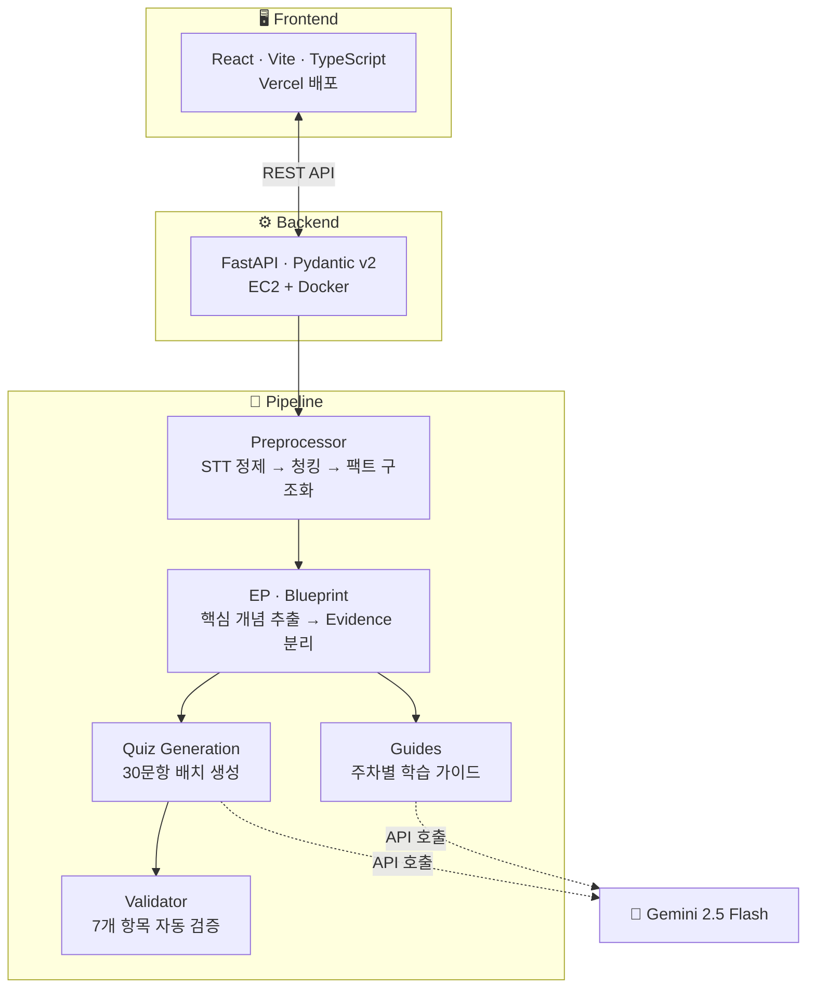

<div align="center">

# 🦁 알려주사자 (Tell Me Lion)

**강의 녹화본을 선택하면, 핵심 개념 · 퀴즈 · 학습 가이드가 자동으로 만들어집니다.**

[](https://github.com/tell-me-lion/wonder-girls/actions/workflows/deploy-backend.yml)
[](https://wonder-girls.vercel.app)


</div>

---

**알려주사자**는 교육 서비스 업체와 수강생을 위한 AI 기반 학습 콘텐츠 자동 생성 시스템입니다.
파일 업로드 없이, 대시보드에서 강의를 선택하기만 하면 서버가 나머지를 처리합니다.

> [!TIP]
> **라이브 데모**: [wonder-girls.vercel.app](https://wonder-girls.vercel.app) — `main` 브랜치에 머지하면 프론트·백엔드 모두 자동 배포됩니다.


---

## 📋 목차

- [주요 기능](#-주요-기능)
- [시스템 아키텍처](#-시스템-아키텍처)
- [파이프라인 상세](#-파이프라인-상세)
- [시작하기](#-시작하기)
- [프로젝트 구조](#-프로젝트-구조)
- [배포](#-배포)
- [팀](#-팀)
- [문서](#-문서)

---

## ✨ 주요 기능

### Mode A — 단일 강의 분석

강의 스크립트 하나를 분석하여 **핵심 개념**, **학습 포인트**, **퀴즈**(객관식 · 빈칸 채우기 · OX · 코드 실행)를 생성합니다.


### Mode B — 주차별 학습 가이드

한 주치 강의 전체를 종합 분석하여 **주차별 학습 가이드**와 **핵심 요약**을 자동 제작합니다.


---

## 🏗 시스템 아키텍처



---

## 🔬 파이프라인 상세

| 단계 | 설명 |
|:-----|:-----|
| **Preprocessor** (Phase 1~5) | STT 텍스트 정제 → 문장 분할 → 시맨틱 청킹 → 명제 추출 → 팩트 구조화 |
| **EP** | 핵심 개념 · 학습 포인트 추출 (Definition 주어 기반, 중요도 산출) |
| **Blueprint** | Evidence 분리 (정답 근거 / 오답 재료), 메타데이터 전달 |
| **Quiz Generation** | Gemini 2.5 Flash 단일 호출로 30문항 배치 생성 |
| **Validator** | 7개 항목 자동 검증 (source_text, 정답 개수, 해설 존재 등) |
| **Guides** | TF-IDF 키워드 빈도 기반 주차별 학습 가이드 · 핵심 요약 생성 |

---

## 🚀 시작하기

### 사전 요구사항

- Node.js 18+
- Python 3.10+
- Google Gemini API 키

### 프론트엔드

```bash
cd frontend
npm install
npm run dev          # http://localhost:5173
```

### 백엔드

```bash
pip install -r requirements.txt
uvicorn app.main:app --reload   # http://localhost:8000
```

<details>
<summary><strong>🔑 환경 변수 설정</strong></summary>

```bash
# frontend/.env.local
VITE_API_URL=http://localhost:8000

# 백엔드 (.env)
GOOGLE_API_KEY=your-gemini-api-key
```

</details>

---

## 📂 프로젝트 구조

<details>
<summary><strong>전체 디렉터리 트리 펼치기</strong></summary>

```
tell-me-lion/
├── frontend/             # React SPA
│   └── src/
│       ├── pages/        # Dashboard, LecturesPage, LectureResult,
│       │                 # WeeklyResult, GuidesPage, QuizPage
│       ├── components/   # ConceptCard, QuizCard, CodeEditor, ProcessingStatus 등
│       ├── services/     # API 호출 (api.ts)
│       ├── hooks/        # 커스텀 훅
│       └── types/        # TypeScript 인터페이스
├── app/                  # FastAPI 백엔드
│   ├── api/routes.py     # REST API 엔드포인트 (12개)
│   ├── schemas/models.py # Pydantic 모델
│   ├── loaders/          # 데이터 로더
│   └── state.py          # 인메모리 Job 상태 관리
├── pipeline/             # AI 처리 파이프라인
│   ├── preprocessor/     # Phase 1~5: STT → 구조화 팩트
│   ├── ep/               # 핵심 개념 · 학습 포인트 추출
│   ├── blueprint/        # 퀴즈 설계 (Evidence 분리)
│   ├── quiz_generation/  # Gemini 기반 퀴즈 생성
│   ├── qa_validation/    # 퀴즈 품질 검증
│   └── guides/           # 학습 가이드 생성
├── config/               # 파이프라인 설정
├── docs/                 # 보고서, 태스크 명세
└── data/                 # 파이프라인 입출력 데이터
```

</details>

---

## 🌐 배포

| 레이어 | 플랫폼 | 주소 | 방식 |
|:-------|:-------|:-----|:-----|
| 프론트엔드 | Vercel | [wonder-girls.vercel.app](https://wonder-girls.vercel.app) | `main` push 시 자동 배포 |
| 백엔드 | AWS EC2 | Docker Compose | GitHub Actions → SSH → `docker compose up` |

> [!NOTE]
> PR을 `main`에 머지하면 **프론트엔드(Vercel)와 백엔드(EC2) 모두 자동으로 배포**됩니다. 수동 배포가 필요 없습니다.

---

## 👥 팀

| 담당 | 역할 |
|:-----|:-----|
| **시훈** | 전처리 파이프라인 (Phase 1~5), 배포 최적화, Gemini API 비용 관리 |
| **경현** | 퀴즈·개념·학습포인트 생성 고도화, Blueprint 설계, 출력 형식 정의 |
| **주노** | UI/UX 설계·구현, 프론트-백 연동, Vercel+EC2 자동 배포 |

---

## 📚 문서

| 문서 | 내용 |
|:-----|:-----|
| [DESIGN.md](./DESIGN.md) | 프론트엔드 디자인 가이드 (색상 · 타이포 · 컴포넌트) |
| [PROJECT_GOALS.md](./PROJECT_GOALS.md) | 프로젝트 목표 · 평가 기준 |
| [docs/최종보고서.md](./docs/최종보고서.md) | 최종 보고서 |
| [docs/preprocessing-flow.md](./docs/preprocessing-flow.md) | 전처리 데이터 플로우 |
