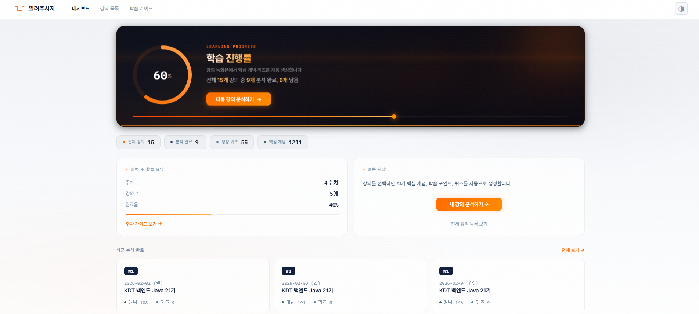
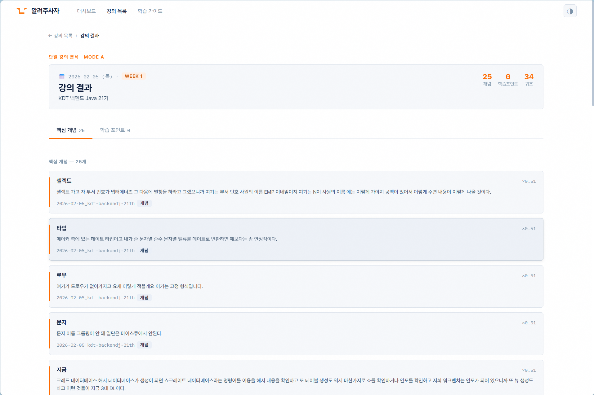
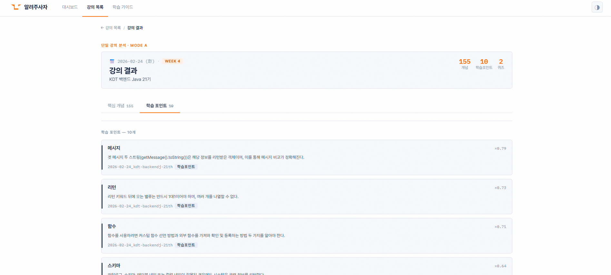
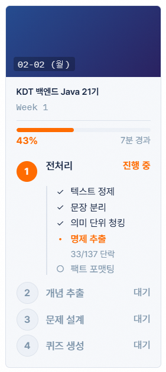
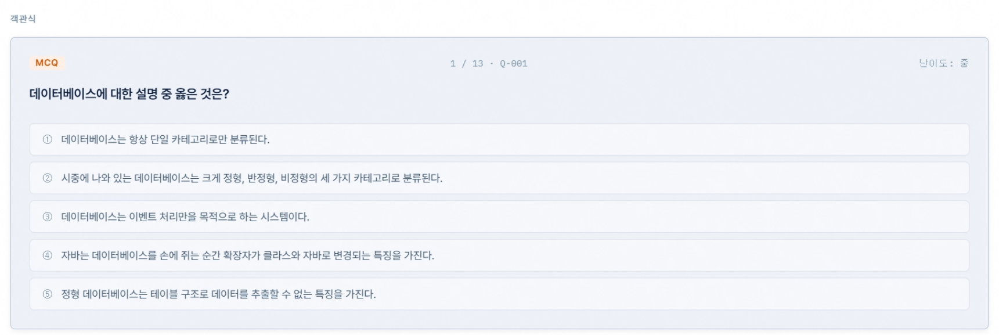
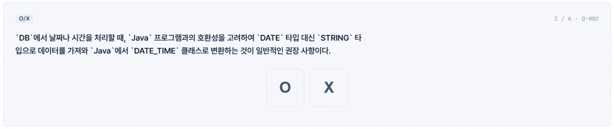
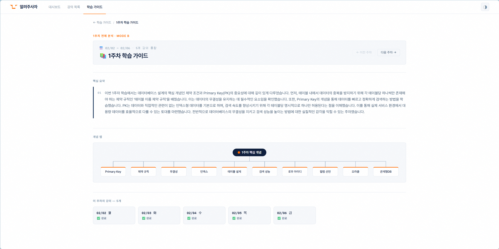
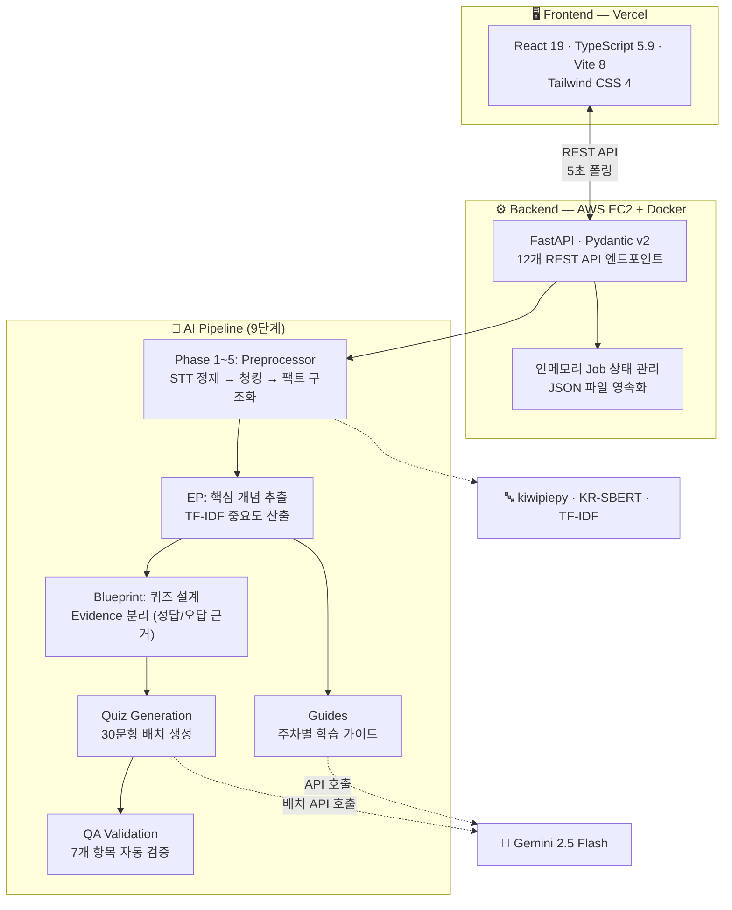
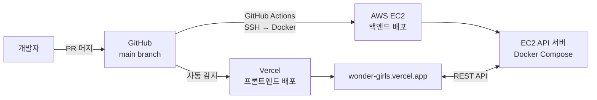

<div align="center">

# 🦁 알려주사자 (Tell Me Lion)

**강의 녹화본을 선택하면, 핵심 개념 · 퀴즈 · 학습 가이드가 자동으로 만들어집니다.**

[](https://github.com/tell-me-lion/wonder-girls/actions/workflows/deploy-backend.yml)
[](https://wonder-girls.vercel.app)


</div>

---

**알려주사자**는 교육 서비스 업체와 수강생을 위한 **AI 기반 학습 콘텐츠 자동 생성 시스템**입니다.
파일 업로드 없이, 대시보드에서 강의를 선택하기만 하면 서버가 나머지를 처리합니다.

- **9단계 AI 파이프라인**: STT 스크립트 → 전처리 → 핵심 개념 추출 → 퀴즈 설계 → LLM 문항 생성 → 자동 검증
- **5가지 퀴즈 유형**: 객관식(정의형/오개념) · 빈칸 채우기 · OX · 코드 분석
- **실시간 진행률 표시**: 8단계 처리 과정을 단계별로 시각화
- **자동 배포**: PR 머지 = 프론트(Vercel) + 백엔드(EC2) 동시 배포 완료

> **개발 기간**: 2026.03.10 ~ 2026.04.02 (24일) · **3인 팀** · **240+ commits** · **56+ PRs**

<div align="center">
  <a href="https://youtu.be/k2Gi1BbiC-4">
    
  </a>
  <p><em>▶ 클릭하여 시연 영상 보기 (1.2분)</em></p>
</div>

---

## 📋 목차

- [주요 기능](#-주요-기능)
- [시스템 아키텍처](#-시스템-아키텍처)
- [파이프라인 상세](#-파이프라인-상세)
- [기술적 도전과 해결](#-기술적-도전과-해결)
- [시작하기](#-시작하기)
- [프로젝트 구조](#-프로젝트-구조)
- [배포](#-배포)
- [기술 스택](#-기술-스택)
- [팀](#-팀)
- [문서](#-문서)

---

## ✨ 주요 기능

### Mode A — 단일 강의 분석

강의 스크립트 하나를 분석하여 **핵심 개념**, **학습 포인트**, **퀴즈**(5가지 유형)를 생성합니다.




<div align="center">
  
</div>

<details>
<summary><strong>퀴즈 유형별 화면 보기</strong></summary>

| 유형 | 설명 |
|------|------|
| **개념 정의형 객관식** | 핵심 개념의 정의를 4~5지선다로 확인 |
| **오개념 객관식** | 흔한 오해를 선지에 포함하여 정확한 이해 검증 |
| **빈칸 채우기** | 핵심 용어를 직접 채워 넣는 방식 |
| **OX 퀴즈** | 참/거짓 판별로 빠른 개념 확인 |
| **코드 분석** | SQL/코드 구문의 실행 결과를 예측하는 문제 |

 

</details>

### Mode B — 주차별 학습 가이드

한 주치 강의 전체를 종합 분석하여 **주차별 학습 가이드**와 **핵심 요약**을 자동 제작합니다.



---

## 🏗 시스템 아키텍처



### 배포 아키텍처



---

## 🔬 파이프라인 상세

### 전처리 (Phase 1~5): STT 스크립트 → 구조화된 팩트

| 단계 | 모듈 | 핵심 작업 | 기술 |
|:-----|:-----|:---------|:-----|
| **Phase 1** | Cleaner | 발화 병합, 오탈자·추임새 교정 | Gemini API |
| **Phase 2** | Segmenter | 구어체 → 문장 단위 분할 | kiwipiepy 형태소 분석 |
| **Phase 3** | Chunker | 의미 단위 시맨틱 청킹 | KR-SBERT 임베딩, 코사인 유사도 |
| **Phase 4** | Extractor | 교육적 핵심 명제(Fact) 추출 | 정규식 + LLM |
| **Phase 5** | Formatter | 개념 그룹화, 역참조, JSON 포맷 조립 | — |

### 생성 및 검증

| 단계 | 설명 |
|:-----|:-----|
| **EP** | 핵심 개념 · 학습 포인트 추출 (Definition 주어 기반, TF-IDF 중요도 0~1 산출) |
| **Blueprint** | 개념별 퀴즈 유형·난이도·수량 사전 설계, Evidence 분리 (정답 근거 / 오답 재료) |
| **Quiz Generation** | Gemini 2.5 Flash **단일 호출로 30문항 배치 생성** (MCQ, 빈칸, OX, 코드 분석), 적응형 재시도 (30→20→15→10) |
| **QA Validation** | 7개 항목 자동 검증 (출처 근거, 정답 개수, 해설 존재 등) → 통과 문항만 저장 |
| **Guides** | TF-IDF 키워드 빈도 기반 주차별 학습 가이드 · 핵심 요약 · 자가 점검 문제 생성 |

### 데이터 흐름

```
data/raw/*.txt              → 원시 강의 스크립트 (입력)
  ↓ Phase 1~5
data/phase5_facts/          → 정제된 팩트 데이터
  ↓ EP
data/ep_concepts/           → 핵심 개념 (산출물 ①)
data/ep_learning_points/    → 학습 포인트 (산출물 ②)
  ↓ Blueprint → Quiz Gen → QA
data/quizzes_validated/     → 검증 완료 퀴즈 (산출물 ③)
  ↓ Guides
data/learning_guides/       → 주차별 학습 가이드 (산출물 ④)
```

---

## 🧩 기술적 도전과 해결

### 1. 퀴즈 품질 보장

**문제**: LLM 직접 생성 시 사실 오류, 모호한 선지, 난이도 편중 발생

**해결**: 4단계 파이프라인으로 분리 — Blueprint(설계) → Evidence(근거 확보) → Generation(생성) → Validation(검증). 오답 선지는 같은 청크의 나머지 facts에서 수집하여 맥락적 그럴듯함을 보장.

### 2. JSON 파싱 실패 복구

**문제**: Gemini API 응답이 토큰 한도에서 잘려 30문항 JSON 파싱 에러 발생

**해결**: 3단계 복구 전략 (마지막 `},` 경계 역순 탐색 → 문자 단위 파서 → 정규식 블록 추출) + 적응형 재시도 (quiz_count 30→20→15→10 감소). 완전 실패 사실상 제거.

### 3. 전처리 효율화

**문제**: 강의 1개 전처리 수 분 소요, 중간 실패 시 처음부터 재시작

**해결**: Phase별 스킵 로직 (출력 파일 존재 확인) + `partial` 상태 도입으로 중단/재개 지원. 세부 진행률 실시간 표시 (`15/42 청크 | 명제 38개`).

### 4. Gemini API 비용 관리

**해결**: Phase 3 시맨틱 청킹으로 LLM 입력 크기 축소, 30문항 단일 호출 배치 생성, Phase별 결과 캐싱으로 중복 호출 제거.

---

## 🚀 시작하기

### 사전 요구사항

- Node.js 18+
- Python 3.12+
- Google Gemini API 키

### 프론트엔드

```bash
cd frontend
npm install
npm run dev          # http://localhost:5173
```

### 백엔드

```bash
pip install -r requirements.txt
uvicorn app.main:app --reload   # http://localhost:8000
```

<details>
<summary><strong>🔑 환경 변수 설정</strong></summary>

```bash
# frontend/.env.local
VITE_API_URL=http://localhost:8000

# 백엔드 (.env)
GOOGLE_API_KEY=your-gemini-api-key
```

</details>

---

## 📂 프로젝트 구조

<details>
<summary><strong>전체 디렉터리 트리 펼치기</strong></summary>

```
tell-me-lion/
├── frontend/                # React 19 + TypeScript 5.9 + Vite 8
│   └── src/
│       ├── pages/           # 7개 페이지: Dashboard, LecturesPage, LectureResult,
│       │                    #   QuizPage, GuidesPage, WeeklyResult, NotFound
│       ├── components/      # 10개 컴포넌트: ConceptCard, QuizCard, CodeEditor,
│       │                    #   ProcessingStatus, ProgressRing, Skeleton 등
│       ├── services/        # API 호출 (api.ts)
│       ├── hooks/           # useWeeks, useCountUp, useProcessingStatus
│       └── types/           # TypeScript 인터페이스 (models.ts)
├── app/                     # FastAPI 백엔드
│   ├── api/routes.py        # REST API 엔드포인트 (12개)
│   ├── schemas/models.py    # Pydantic 모델
│   ├── loaders/             # 카탈로그·결과 데이터 로더
│   └── state.py             # 인메모리 Job 상태 관리 + JSON 영속화
├── pipeline/                # AI 처리 파이프라인 (9단계)
│   ├── preprocessor/        # Phase 1~5: cleaner → segmenter → chunker
│   │                        #            → extractor → formatter
│   ├── ep/                  # 핵심 개념·학습 포인트 추출
│   ├── blueprint/           # 퀴즈 설계 (Evidence 분리)
│   ├── quiz_generation/     # Gemini 기반 30문항 배치 생성
│   ├── qa_validation/       # 7개 항목 품질 검증
│   └── guides/              # 주차별 학습 가이드 생성
├── config/                  # 파이프라인 설정 (quiz_blueprint_rules, rag_config)
├── docs/                    # 보고서, 태스크 명세
├── .github/workflows/       # CI/CD (deploy-backend.yml)
├── Dockerfile               # Python 3.12 + kiwipiepy
├── docker-compose.yml       # 백엔드 컨테이너 오케스트레이션
└── data/                    # 파이프라인 입출력 데이터 (12개 단계별 디렉터리)
```

</details>

---

## 🌐 배포

| 레이어 | 플랫폼 | 주소 | 방식 |
|:-------|:-------|:-----|:-----|
| 프론트엔드 | Vercel | [wonder-girls.vercel.app](https://wonder-girls.vercel.app) | `main` push 시 자동 배포 |
| 백엔드 | AWS EC2 | Docker Compose | GitHub Actions → SSH → `docker compose up` → health check |

> **PR을 `main`에 머지하면 프론트엔드(Vercel)와 백엔드(EC2) 모두 자동으로 배포됩니다.** 수동 배포 불필요.

---

## 🛠 기술 스택

| 영역 | 기술 |
|:-----|:-----|
| **프론트엔드** | React 19, TypeScript 5.9, Vite 8, Tailwind CSS 4, React Router v7 |
| **백엔드** | FastAPI, Python 3.12, Pydantic v2, Uvicorn, asyncio |
| **AI 파이프라인** | Gemini 2.5 Flash, kiwipiepy (한국어 형태소 분석), KR-SBERT, scikit-learn (TF-IDF) |
| **인프라** | Docker, Docker Compose, GitHub Actions, Vercel, AWS EC2 |

---

## 👥 팀

| 담당 | 역할 |
|:-----|:-----|
| **시훈** | 전처리 파이프라인 (Phase 1~5), 배포 최적화, Gemini API 비용 관리 |
| **경현** | 퀴즈·개념·학습포인트 생성 고도화, Blueprint 설계, 출력 형식 정의 |
| **주노** | UI/UX 설계·구현, 프론트-백 연동, Vercel+EC2 자동 배포, FastAPI 백엔드 |

---

## 📚 문서

| 문서 | 내용 |
|:-----|:-----|
| [DESIGN.md](./DESIGN.md) | 프론트엔드 디자인 가이드 (색상 · 타이포 · 컴포넌트) |
| [PROJECT_GOALS.md](./PROJECT_GOALS.md) | 프로젝트 목표 · 평가 기준 |
| [docs/최종보고서.md](./docs/최종보고서.md) | 최종 보고서 |
| [docs/preprocessing-flow.md](./docs/preprocessing-flow.md) | 전처리 데이터 플로우 |
