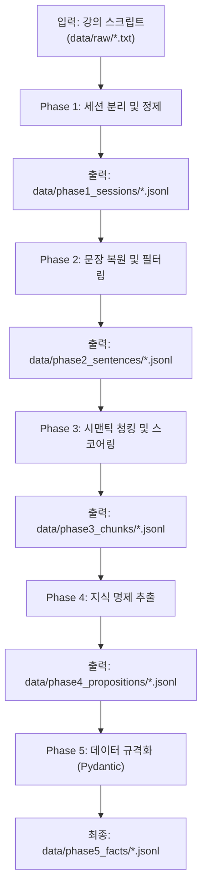

# Pre-processor (전처리) 데이터 플로우 가이드

전처리(Phase 1 ~ Phase 5) 파이프라인의 데이터 흐름과 각 단계별 입출력 형태 및 주요 역할을 정의한다.

전처리 파이프라인의 최종 목적은 정제되지 않은 강의 스크립트(`raw`)를 단계적으로 가공하여, 모델 학습 및 문제 생성에 즉시 활용 가능한 **구조화된 지식 명제 데이터(Facts)**로 변환하는 것이다.

---

## 전체 데이터 플로우



---

## Phase별 상세 스펙

### Phase 1: 데이터 분리 및 물리적 세척 (`01_cleaner.py`)

- **목적:** 시간 흐름에 따른 맥락 보존을 위해 물리적으로 단락 및 세션을 분리하고, 문맥 기반의 클렌징을 적용한다.
- **입력:** `data/raw/*.txt` (원본 STT 스크립트)
- **출력:** `data/phase1_sessions/*.jsonl`
- **핵심 작업:**
  - **인접 라인 병합:** 시간 간격 15초 이내의 발화는 같은 단락(Paragraph)으로 병합하여 문맥 단위를 확보한다.
  - **세션 자동 분할:** 발화 간격이 30분 이상 벌어질 경우 새로운 논리적 세션으로 자동 분할한다.
  - **정제 및 교정 (Gemini API):** 사전(Dictionary) 치환 방식의 한계를 극복하기 위해, 병합된 단락 단위로 Gemini API를 호출하여 문맥을 해치지 않고 오탈자 교정 및 추임새를 제거한다. (정규식은 화자 ID와 불필요한 다중 공백 압축에만 사용)
- **데이터 형태:**
  ```json
  {
    "chunk_id": "2026-02-02_kdt-backendj-21th_오전",
    "source_file": "2026-02-02_kdt-...txt",
    "session": 1,
    "time": "09:03:12",
    "paragraph": "...정제된 단락 텍스트..."
  }
  ```

### Phase 2: 형태소 기반 문장 복원 및 필터링 (`02_segmenter.py`)

- **목적:** 발화 단위의 텍스트를 완전한 문장 단위로 쪼개고, 영양가 없는 문장을 버린다.
- **입력:** `data/phase1_sessions/*.jsonl`
- **출력:** `data/phase2_sentences/*.jsonl`
- **핵심 작업:**
  - **문장 분리:** `kiwipiepy` 형태소 분석기를 사용하여 마침표가 없는 구어체 텍스트를 문장 단위로 분할한다.
  - **품사(POS) 기반 필터링:** 명사나 동사가 거의 포함되지 않은 단순 감탄사 문장("네", "아 맞습니다" 등)을 제외하여 데이터 밀도를 높인다.
- **데이터 형태:**
  ```json
  {
    "session_id": "...",
    "sent_id": 12,
    "text": "데이터베이스에서 트랜잭션이란 ...",
    "pos_tags": [...],
    "meta": {...}
  }
  ```

### Phase 3: 시맨틱 청킹 및 중요도 스코어링 (`03_chunker.py`)

- **목적:** 잘게 쪼개진 문장들을 문맥과 의미가 이어지는 단위로 다시 묶고, 해당 묶음(Chunk)에서 중요한 키워드를 뽑아낸다.
- **입력:** `data/phase2_sentences/*.jsonl`
- **출력:** `data/phase3_chunks/*.jsonl`
- **핵심 작업:**
  - **의미 기반 청킹:** `KR-SBERT` 임베딩으로 인접 문장 간의 코사인 유사도를 계산하고, 유사도가 떨어지는 문맥 전환 지점에서 청크를 분할한다.
  - **핵심어 추출(TF-IDF):** 청크 안에서 전체 문서 대비 중요도가 높은 단어들을 식별하고, TF-IDF 점수를 메타데이터에 기록한다.
- **데이터 형태:**
  ```json
  {
    "chunk_id": "S01-C03",
    "session_id": "S01",
    "sent_ids": [10, 11, 12],
    "text": "...여러 문장 합친 내용...",
    "keywords": ["트랜잭션", "격리성"],
    "tfidf_scores": {"트랜잭션": 3.21},
    "meta": {...}
  }
  ```

### Phase 4: 지식 명제 추출 및 구조화 (`04_extractor.py`)

- **목적:** 청크 텍스트 속에서 교육적으로 의미 있는 '규칙, 정의, 절차' 등의 핵심 명제(Fact 후보)를 추출한다.
- **입력:** `data/phase3_chunks/*.jsonl`
- **출력:** `data/phase4_propositions/*.jsonl`
- **핵심 작업:**
  - **패턴 기반 탐지:** `~란 ...이다`, `~하는 방법은` 등의 정규식 패턴으로 1차 명제를 추출한다.
  - **LLM 기반 추출:** Gemini API 또는 로컬 Ollama(`gemma3:12b`) 모델로 텍스트 내 팩트 명제를 생성한다.
  - **개념 매칭:** Phase 3의 핵심 키워드와 추출된 명제를 결합하여 `[개념-설명]` 세트 후보군을 만든다.
- **데이터 형태:**
  ```json
  {
    "prop_id": "P-000123",
    "chunk_id": "S01-C03",
    "type": "definition",
    "text": "트랜잭션이란 ... 이다.",
    "concept_candidates": ["트랜잭션"],
    "meta": {"source_sents": [...], "model": "gemma3:12b"}
  }
  ```

### Phase 5: 최종 포매팅 및 팩트 DB 구축 (`05_formatter.py`)

- **목적:** 추출된 지식 명제(Phase 4)와 청크 원문/키워드(Phase 3)를 결합하여 RAG에 최적화된 구조화 JSON으로 조립한다.
- **입력:**
  - `data/phase3_chunks/*.jsonl`
  - `data/phase4_propositions/*.jsonl`
- **출력:** `data/phase5_facts/*.jsonl`
- **핵심 작업:**
  - **ChunkDocument 생성:** Phase 3 chunk에 보존된 `time`과 `session_id`를 활용하여 세션 라벨(`session`)을 시간대 기반(12시 기준 오전/오후)으로 자동 부여하고, 해당 청크에서 도출된 팩트 명제(`facts`)를 리스트로 매핑한다.
  - **ConceptDocument 생성:** 파편화된 명제들을 개념(`concept`) 단위로 그룹화한다. 동일 개념 문장들을 병합(`definition`)하고, 역참조 정보(`source_chunk_ids`)와 연관어(`related_concepts`)를 추가하여 RAG에 유리한 지식 DB를 조립한다.

- **데이터 형태 1: ChunkDocument** (`*_chunks_formatted.jsonl`)
  ```json
  {
    "chunk_id": "2026-02-03_S01_C002",
    "session": "오전",
    "session_seq": 1,
    "start_time": "09:11:04",
    "text": "테이블을 병합하는 방법은 ...",
    "facts": ["조인은 관계 기반 데이터 결합으로 ..."],
    "tfidf_keywords": ["조인", "셋 연산자", "서브쿼리"]
  }
  ```

  | 필드 | 설명 |
  |------|------|
  | `session` | 12시 기준 오전/오후 자동 라벨 |
  | `session_seq` | 하루 내 세션 순서 번호 (Phase 1의 30분 gap 기반) |
  | `start_time` | 해당 청크의 시작 시각 |

- **데이터 형태 2: ConceptDocument** (`*_concepts_formatted.jsonl`)
  ```json
  {
    "concept_id": "concept_union",
    "concept": "UNION",
    "definition": "두 SELECT 결과를 세로로 병합하면서 ...",
    "related_concepts": ["concept_join", "concept_cast"],
    "source_chunk_ids": ["c02", "c03"],
    "importance": 0.87,
    "week": 21,
    "lecture_id": "2026-02-11_kdt..."
  }
  ```

---

## CLI 실행 가이드

전처리 파이프라인은 `scripts/run_pipeline.py`를 통해 실행한다. 직접 스크립트 호출 금지.

```bash
# 전체 전처리 실행 (Phase 1~5)
python scripts/run_pipeline.py --mode a --input data/raw/lecture_01.txt

# Phase 범위 지정
python scripts/run_pipeline.py --mode a --from-phase 1 --to-phase 3

# 전처리 블록만 실행
python scripts/run_pipeline.py --mode a --from-block preproc --to-block preproc
```

### Phase 4 LLM 엔진 선택

```bash
# 기본: Google Gemini API
python scripts/run_pipeline.py --mode a --from-phase 4 --to-phase 4

# 로컬 Ollama 사용
python scripts/run_pipeline.py --mode a --from-phase 4 --to-phase 4 --use-ollama

# LLM 없이 정규식만
python scripts/run_pipeline.py --mode a --from-phase 4 --to-phase 4 --no-gemini
```

---

## 가이드

- 전처리의 최우선 목표: **원본 텍스트를 정보 밀도가 높은 상태로, 군더더기 없이 가공하는 것**
- 각 단계 스크립트는 명시된 입력 JSON 포맷을 받아 정해진 출력 JSON으로 반환하는 **독립 모듈** 형태를 유지한다.
- 모든 경로는 `pipeline/paths.py` 상수를 사용한다. 문자열 하드코딩 금지.
- `data/` 디렉터리는 git 관리 대상이 아니다. 로컬 런타임에 의해서만 생성·소모된다.
