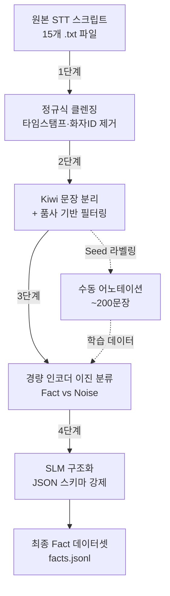

# 강의 스크립트 → '사실(Fact)' 데이터셋 추출 파이프라인 구현 계획

## 개요

KDT 백엔드 Java 21th 강의 STT 스크립트(15개 파일, 총 ~3.3MB)에서 **프로그래밍 사실(Fact) 명제**를 추출하여 구조화된 JSON 데이터셋으로 변환하는 파이프라인을 구축합니다.

## 데이터 분석 결과

### 원본 데이터 특성

| 항목 | 값 |
|------|-----|
| 파일 수 | 15개 (`2026-02-02` ~ `2026-02-27`) |
| 파일 크기 | 각 135KB ~ 265KB |
| 총 라인 수 | 파일당 ~1,400줄 |
| 형식 | `<HH:MM:SS> 화자ID: 텍스트` |
| 화자 | 단일 화자 (`b54f46b0`) - 강사 |
| 주제 | Java I/O, NIO, 컬렉션, 제네릭 등 백엔드 Java |

### 핵심 노이즈 패턴 (실제 데이터에서 확인)

```
- 상투적 표현: "자", "여러분", "오늘", "일단은", "됐을까요?", "이해 가죠"
- 구어 메타발화: "네 좋습니다.", "옳지", "알겠다", "되셨어요", "너무 쉽지 않아"
- STT 오인식: "사부작" (→ 반복적 오인식), "브나이어" (→ NIO), "잡바" (→ Java)
- 화면 지시: "살짝 누르면", "마우스 가져다 대면", "여기 보면"
- 비정보 문장: "뭐 이런 거", "그렇지", "이렇게", "됐어요"
```

### 추출 대상 '사실' 예시 (데이터에서 발견)

```
✅ "자바 IO 스트림은 바이트 단위 처리를 기본으로 하고 모든 데이터는 바이트 변환되어 처리된다"
✅ "BufferedReader의 readLine()은 한 줄씩 String으로 리턴하며, 마지막에 null을 리턴한다"
✅ "Java NIO2의 Files 클래스는 바이트/문자/객체 단위를 통합 관리하는 정적 메서드를 제공한다"
✅ "OutputStream의 write() 메서드는 int를 받지만 1바이트씩만 처리한다"
❌ "자 그러면 이제 한번 해보자" (행동 지시 → 노이즈)
❌ "네 좋습니다. 됐을까요?" (단순 호응 → 노이즈)
```

---

## 파이프라인 아키텍처



---

## 단계별 구현 계획

### 1단계: 정규식 기반 1차 클렌징

> **목표**: 기계적 노이즈를 제거하고 순수 텍스트만 추출

#### 구현 내용

- **타임스탬프 + 화자 ID 제거**: `<\d{2}:\d{2}:\d{2}>\s[a-f0-9]+:\s` 패턴
- **인접 라인 병합**: 같은 화자의 연속 발화를 시간 간격 기준(예: 15초 이내)으로 하나의 단락으로 병합
- **단순 불용어 문장 제거**: 아래 사전 기반
  ```
  완전 매칭: "네", "자", "됐을까요?", "되셨어요", "옳지", "알겠다", "그렇지", "네 좋습니다"
  시작 패턴: "자 ", "여러분 ", "일단은 ", "오늘 "
  ```
- **STT 오인식 보정 사전**: `{"잡바": "자바", "사부작": "", "브나이어": "NIO", ...}`

#### 입출력

| 입력 | 출력 |
|------|------|
| `donotuploadthis/강의 스크립트/*.txt` | `pipeline/01_cleaned/*.txt` |
| 라인당 `<HH:MM:SS> ID: text` | 단락 단위 순수 텍스트 |

#### 구현 파일

- **[NEW]** `pipeline/step01_clean.py` — 클렌징 스크립트
- **[NEW]** `pipeline/config/stopwords.json` — 불용어 사전
- **[NEW]** `pipeline/config/stt_corrections.json` — STT 오인식 보정 사전

---

### 2단계: Kiwi 형태소 분석기 기반 문장 분리 + 필터링

> **목표**: 단락을 논리적 문장으로 분리하고, 정보량 없는 문장을 걸러냄

#### 구현 내용

- **Kiwi `split_into_sents()`**: 구어체에 강한 문장 분리
- **품사 기반 필터링 규칙**:
  - **DROP**: 명사(NNG) 또는 동사(VV)가 0개인 문장
  - **DROP**: 전체 토큰 중 감탄사(IC) + 접속사(MAJ) 비율 ≥ 70%
  - **DROP**: 토큰 수 ≤ 3인 문장 (예: "그렇지", "네 좋습니다")
  - **KEEP**: 명사 ≥ 2개 AND 동사 ≥ 1개인 문장 → 우선 유지
- **중복 문장 제거**: 정규화 후 완전 일치 또는 Jaccard 유사도 ≥ 0.85 문장 제거

#### 입출력

| 입력 | 출력 |
|------|------|
| `pipeline/01_cleaned/*.txt` | `pipeline/02_sentences/*.jsonl` |
| 단락 단위 텍스트 | `{"id": "...", "sentence": "...", "source_file": "...", "pos_tags": [...]}` |

#### 구현 파일

- **[NEW]** `pipeline/step02_segment.py`
- **의존성**: `kiwipiepy` (pip install)

---

### 3단계: 경량 인코더 모델 — Fact vs Noise 이진 분류

> **목표**: 각 문장이 '핵심 지식(Fact)'인지 '단순 잡담/설명(Noise)'인지 분류

#### 3-A. Seed 라벨링 (수동 어노테이션)

> [!IMPORTANT]
> 이 단계는 **사용자의 수동 작업**이 필요합니다. 최소 ~200문장에 대해 Fact(1)/Noise(0) 라벨을 부여해야 합니다.

- 2단계 출력에서 3~4개 파일 분량(~200문장)을 샘플링
- 간단한 라벨링 도구(CSV/스프레드시트) 제공
- **[NEW]** `pipeline/step03a_sample_for_labeling.py` — 샘플 추출기
- **출력**: `pipeline/03_labels/seed_labels.csv` (sentence_id, label)

#### 3-B. 모델 파인튜닝 & 추론

- **모델**: `monologg/koelectra-base-v3-discriminator` (110M 파라미터)
- 이진 분류 헤드 부착 → `seed_labels.csv`로 몇 에폭 파인튜닝
- 전체 문장에 대해 추론 → `fact_score` 부여
- 임계값(threshold) 기반 필터링 (예: score ≥ 0.7 → Fact)

#### 3-C. 시맨틱 청킹 (선택적)

- 코사인 유사도로 문장 간 주제 전환점을 감지
- 같은 주제 클러스터 내에서 대표 문장 선택 → 중복 정보 압축

#### 입출력

| 입력 | 출력 |
|------|------|
| `pipeline/02_sentences/*.jsonl` | `pipeline/03_classified/*.jsonl` |
| 전체 문장 | `{"sentence": "...", "fact_score": 0.92, "label": "fact", "topic_cluster": 3}` |

#### 구현 파일

- **[NEW]** `pipeline/step03a_sample_for_labeling.py`
- **[NEW]** `pipeline/step03b_train_classifier.py`
- **[NEW]** `pipeline/step03c_semantic_chunk.py` (선택)
- **의존성**: `transformers`, `torch`, `scikit-learn`

---

### 4단계: 로컬 SLM + 구조화 파서 — Fact JSON 생성

> **목표**: 분류된 Fact 문장들을 구조화된 JSON으로 변환

#### 최종 Fact 스키마

```json
{
  "fact_id": "F-20260202-0042",
  "statement": "Java IO의 OutputStream은 추상 클래스이며, 바이트 단위 출력의 최상위 클래스이다.",
  "subject": "OutputStream",
  "predicate": "~이다",
  "object": "바이트 단위 출력의 최상위 추상 클래스",
  "category": "Java IO",
  "confidence": 0.91,
  "source": {
    "file": "2026-02-02_kdt-backendj-21th.txt",
    "approx_time": "09:49:58"
  }
}
```

#### 구현 접근

- **모델**: `Qwen2.5-7B-Instruct` 또는 `Llama-3-8B-Instruct` (로컬 GPU 구동)
- **구조화 강제**: `instructor` 또는 `outlines` 라이브러리를 통해 Pydantic 스키마 강제
- **배치 처리**: Fact 문장 클러스터(5~10문장)을 한번에 넘기고, 클러스터당 주요 Fact 3~5개 추출
- **후처리**: 중복 fact 제거 (임베딩 코사인 유사도 ≥ 0.9)

#### 입출력

| 입력 | 출력 |
|------|------|
| `pipeline/03_classified/*.jsonl` | `pipeline/04_facts/facts.jsonl` |
| Fact로 분류된 문장 클러스터 | 구조화된 Fact JSON |

#### 구현 파일

- **[NEW]** `pipeline/step04_structurize.py`
- **[NEW]** `pipeline/schemas.py` — Pydantic 스키마 정의
- **의존성**: `instructor` 또는 `outlines`, `vllm` 또는 `llama-cpp-python`

---

## 프로젝트 구조

```
prototype00/
├── plan.md                          # 기존 대략적 계획
├── pipeline/
│   ├── config/
│   │   ├── stopwords.json
│   │   └── stt_corrections.json
│   ├── schemas.py                   # Pydantic Fact 스키마
│   ├── step01_clean.py              # 1단계: 정규식 클렌징
│   ├── step02_segment.py            # 2단계: Kiwi 문장 분리
│   ├── step03a_sample_for_labeling.py
│   ├── step03b_train_classifier.py  # 3단계: 이진 분류
│   ├── step03c_semantic_chunk.py    # (선택) 시맨틱 청킹
│   ├── step04_structurize.py        # 4단계: SLM 구조화
│   ├── run_pipeline.py              # 전체 파이프라인 실행기
│   └── requirements.txt
├── donotuploadthis/
│   └── 강의 스크립트/               # 원본 데이터 (gitignore)
└── .gitignore
```

---

## 사용자 검토 필요 사항

> [!IMPORTANT]
> **수동 라벨링 분량**: 3단계 분류기 학습에 최소 ~200문장의 수동 라벨(Fact/Noise)이 필요합니다. 이 분량이 부담된다면, 규칙 기반(heuristic) 분류로 대체할 수 있지만 정확도가 떨어집니다.

> [!WARNING]
> **GPU 요구사항**: 3단계(KoELECTRA 파인튜닝) 및 4단계(7B~8B SLM)에는 GPU가 필요합니다. 로컬 GPU 사양이 어떻게 되시나요? GPU가 없다면 Colab이나 API 기반 대안을 검토할 수 있습니다.

1. **파이프라인을 어디까지 먼저 구현할지**: 1~2단계만 먼저 돌려서 데이터를 확인한 뒤 3단계로 넘어가는 것을 추천합니다. 동의하십니까?
2. **STT 오인식 보정 사전**: 강의 도메인(Java)에 자주 나타나는 오인식 패턴을 더 알고 계시면 알려주세요.
3. **Fact 스키마**: 위 JSON 스키마가 용도에 적합한지, 필드 추가/제거가 필요한지 확인해주세요.

---

## 검증 계획

### 자동 검증

1. **1단계 검증**: 클렌징 전후 라인 수 비교, 타임스탬프 잔존 여부 grep 확인
   ```bash
   python pipeline/step01_clean.py
   grep -P "<\d{2}:\d{2}:\d{2}>" pipeline/01_cleaned/*.txt  # 0건이어야 함
   ```

2. **2단계 검증**: 문장 수 카운트, 드랍된 문장 로그 확인
   ```bash
   python pipeline/step02_segment.py
   # 출력에 "total_sentences", "dropped_sentences" 통계 포함
   ```

3. **3단계 검증**: 수동 라벨과 모델 예측 간 일치율(F1 ≥ 0.75 목표)
   ```bash
   python pipeline/step03b_train_classifier.py --eval
   ```

### 수동 검증

4. **각 단계 출력 샘플 10건씩 육안 확인** — 정보 손실 없이 노이즈가 제거되었는지
5. **최종 Fact JSON 50건 사용자 검토** — 사실 정확성, 주어-술어 구조 자연스러움
