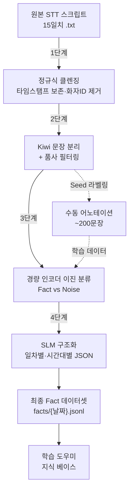

# 강의 스크립트 → '사실(Fact)' 데이터셋 추출 파이프라인 구현 계획

## 개요

KDT 백엔드 Java 21th 강의 STT 스크립트(15일치, 총 ~3.3MB)에서 **프로그래밍 사실(Fact) 명제**를 추출하여 **일차별·시간대별로 구조화된 JSON 데이터셋**으로 변환합니다. 이 데이터셋은 **학습 도우미** 제작의 핵심 지식 베이스로 활용되며, "그날 강의가 어떤 흐름으로 진행되었는지" 시간순 재구성이 가능해야 합니다.

### 하드웨어 환경

| 항목 | 사양 |
|------|------|
| GPU | RTX 4090 Laptop (16GB VRAM, 커스텀 고클럭) |
| 비고 | 7B~8B SLM 로컬 추론 충분, KoELECTRA 파인튜닝 가능 |

---

## 데이터 분석 결과

### 원본 데이터 특성

| 항목 | 값 |
|------|-----|
| 파일 수 | 15개 (`2026-02-02` ~ `2026-02-27`) |
| 파일 크기 | 각 135KB ~ 265KB, **파일 1개 = 1일치 강의** |
| 형식 | `<HH:MM:SS> 화자ID: 텍스트` |
| 화자 | 단일 화자 (`b54f46b0`) - 강사 |
| 시간대 패턴 | 오전(09:xx~12:xx) → 점심 휴식 → 오후(01:xx~06:xx) |

### 핵심 노이즈 패턴

```
- 상투적 표현: "자", "여러분", "됐을까요?", "이해 가죠", "옳지"
- STT 오인식: "잡바"→Java, "사부작"→반복 오인식, "브나이어"→NIO
- 화면 지시: "살짝 누르면", "마우스 가져다 대면", "여기 보면"
- 비정보 문장: "뭐 이런 거", "그렇지", "됐어요"
```

### 추출 대상 '사실' 예시

```
✅ "자바 IO 스트림은 바이트 단위 처리를 기본으로 하고 모든 데이터는 바이트 변환되어 처리된다"
✅ "BufferedReader의 readLine()은 한 줄씩 String으로 리턴하며, 마지막에 null을 리턴한다"
❌ "자 그러면 이제 한번 해보자" (행동 지시 → 노이즈)
```

---

## 파이프라인 아키텍처



> [!IMPORTANT]
> **핵심 설계 원칙**: 모든 단계에서 **원본 타임스탬프를 메타데이터로 보존**합니다. 타임스탬프는 텍스트에서는 제거하되, 각 문장/Fact에 `time` 필드로 유지하여 일차별 강의 흐름 재구성이 가능하도록 합니다.

---

## 단계별 구현 계획

### 1단계: 정규식 기반 1차 클렌징

> **목표**: 기계적 노이즈를 제거하되 **타임스탬프를 메타데이터로 보존**

#### 구현 내용

- **타임스탬프 추출 후 메타데이터 보존**: 텍스트에서는 제거하되, 각 라인에 `time` 필드로 보존
- **화자 ID 제거**: `[a-f0-9]+:\s` 패턴 (단일 화자이므로 불필요)
- **인접 라인 병합**: 시간 간격 15초 이내 연속 발화를 하나의 단락으로 병합 (단락의 time = 첫 라인의 time)
- **시간대(Session) 자동 감지**: 타임스탬프 gap ≥ 30분 → 세션 분리 (오전/오후/…)
- **단순 불용어 문장 제거** + **STT 오인식 보정 사전** 적용

#### 입출력 (일차별 분리)

| 입력 | 출력 |
|------|------|
| `donotuploadthis/강의 스크립트/2026-02-02_*.txt` | `pipeline/01_cleaned/2026-02-02.jsonl` |

출력 포맷:
```json
{"day": "2026-02-02", "session": 1, "time": "09:11:17", "paragraph": "저희가 오늘 수업할 내용은 자바 IO 패키지가..."}
```

#### 구현 파일

- **[NEW]** `pipeline/step01_clean.py`
- **[NEW]** `pipeline/config/stopwords.json`
- **[NEW]** `pipeline/config/stt_corrections.json`

---

### 2단계: Kiwi 형태소 분석기 기반 문장 분리 + 필터링

> **목표**: 단락을 논리적 문장으로 분리, 정보량 없는 문장 제거. **시간·세션 메타데이터 전달**.

#### 구현 내용

- **Kiwi `split_into_sents()`** → 단락 내 문장 분리 (시간·세션 메타는 단락에서 상속)
- **품사 기반 필터링**: 명사(NNG) 0개 or 토큰 ≤ 3 → DROP
- **문장 내 순서 인덱스** 부여 (같은 단락 내 문장 순서)

#### 입출력

| 입력 | 출력 |
|------|------|
| `pipeline/01_cleaned/{날짜}.jsonl` | `pipeline/02_sentences/{날짜}.jsonl` |

```json
{"id": "20260202-S1-P003-02", "day": "2026-02-02", "session": 1, "time": "09:12:04", "seq": 42, "sentence": "NIO 패키지 안에는 바이트 버퍼에 데이터를 넣었다가 일괄로 전송하는 개념이다.", "pos_tags": ["NNG", "NNG", "VV", ...]}
```

> `id` 구성: `{날짜}-S{세션}-P{단락번호}-{문장번호}`, `seq`: 해당 일차 내 전체 문장 순번

#### 구현 파일

- **[NEW]** `pipeline/step02_segment.py`
- **의존성**: `kiwipiepy`

---

### 3단계: 경량 인코더 모델 — Fact vs Noise 이진 분류

> **목표**: 각 문장이 '핵심 지식(Fact)'인지 분류. RTX 4090 16GB에서 실행.

#### 3-A. Seed 라벨링

> [!IMPORTANT]
> 최소 ~200문장에 대한 Fact(1)/Noise(0) 수동 라벨이 필요합니다.

- **[NEW]** `pipeline/step03a_sample_for_labeling.py` — 3~4일치에서 균등 샘플링
- **출력**: `pipeline/03_labels/seed_labels.csv`

#### 3-B. KoELECTRA 파인튜닝 & 추론

- **모델**: `monologg/koelectra-base-v3-discriminator` (110M, 16GB에서 여유롭게 학습)
- 이진 분류 헤드 → 수 에폭 파인튜닝 → 전체 문장 `fact_score` 부여
- 임계값 score ≥ 0.7 → Fact

#### 3-C. 시맨틱 청킹 (선택)

- 코사인 유사도로 주제 전환점 감지 → `topic_cluster` 부여

#### 입출력

| 입력 | 출력 |
|------|------|
| `pipeline/02_sentences/{날짜}.jsonl` | `pipeline/03_classified/{날짜}.jsonl` |

```json
{"id": "20260202-S1-P003-02", "day": "2026-02-02", "session": 1, "time": "09:12:04", "seq": 42, "sentence": "...", "fact_score": 0.92, "label": "fact", "topic_cluster": 3}
```

#### 구현 파일

- **[NEW]** `pipeline/step03a_sample_for_labeling.py`
- **[NEW]** `pipeline/step03b_train_classifier.py`
- **[NEW]** `pipeline/step03c_semantic_chunk.py` (선택)
- **의존성**: `transformers`, `torch`, `scikit-learn`

---

### 4단계: 로컬 SLM + 구조화 파서 — 일차별 Fact JSON 생성

> **목표**: Fact 문장을 **일차별·시간순 구조화 JSON**으로 변환. 학습 도우미가 "2월 2일 오전 강의 흐름"을 재구성할 수 있도록 설계.

#### 최종 Fact 스키마

```json
{
  "fact_id": "F-20260202-0042",
  "day": "2026-02-02",
  "session": 1,
  "time": "09:49:58",
  "seq": 42,
  "statement": "Java IO의 OutputStream은 추상 클래스이며, 바이트 단위 출력의 최상위 클래스이다.",
  "subject": "OutputStream",
  "predicate": "~이다",
  "object": "바이트 단위 출력의 최상위 추상 클래스",
  "category": "Java IO",
  "topic": "바이트 스트림 클래스 계층구조",
  "confidence": 0.91,
  "related_facts": ["F-20260202-0041", "F-20260202-0043"]
}
```

> **학습 도우미 활용 설계**:
> - `day` + `session` + `seq` → 해당 일차 강의 흐름 시간순 재구성
> - `topic` → 강의 주제 변화 추적 ("오전에 IO 기초 → 오후에 NIO2 전환")
> - `related_facts` → 연관 사실 내비게이션
> - `category` → 분류별 지식맵 생성

#### 구현 접근

- **모델**: `Qwen2.5-7B-Instruct` (GPTQ/AWQ 4bit quantized → 16GB VRAM 충분)
- **구조화 강제**: `instructor` + Pydantic 스키마
- **배치 처리**: 같은 `topic_cluster` 내 문장 5~10개 → 클러스터당 주요 Fact 3~5개 추출
- **일차별 출력**: `facts/2026-02-02.jsonl`, `facts/2026-02-03.jsonl`, …

#### 입출력

| 입력 | 출력 |
|------|------|
| `pipeline/03_classified/{날짜}.jsonl` | `pipeline/04_facts/{날짜}.jsonl` |

#### 구현 파일

- **[NEW]** `pipeline/step04_structurize.py`
- **[NEW]** `pipeline/schemas.py` — Pydantic Fact/DaySession 스키마
- **의존성**: `instructor`, `vllm` 또는 `llama-cpp-python`

---

## 프로젝트 구조

```
prototype00/
├── docs/
│   ├── plan.md                          # 기존 대략적 계획
│   └── 사실데이터셋추출플랜.md           # 상세 구현 플랜 (이 문서)
├── pipeline/
│   ├── config/
│   │   ├── stopwords.json
│   │   └── stt_corrections.json
│   ├── schemas.py                       # Pydantic 스키마
│   ├── step01_clean.py
│   ├── step02_segment.py
│   ├── step03a_sample_for_labeling.py
│   ├── step03b_train_classifier.py
│   ├── step03c_semantic_chunk.py
│   ├── step04_structurize.py
│   ├── run_pipeline.py
│   └── requirements.txt
├── donotuploadthis/
│   └── 강의 스크립트/                    # 원본 (gitignore)
└── .gitignore
```

---

## 검증 계획

### 자동 검증

1. **1단계**: 타임스탬프 잔존 0건 + 일차별 파일 15개 생성 확인
2. **2단계**: 문장 수 카운트, 드랍 통계 로그
3. **3단계**: F1 ≥ 0.75 목표 (수동 라벨 대비)

### 수동 검증

4. **각 단계 출력 샘플 10건 육안 확인**
5. **최종 Fact JSON 50건** — 사실 정확성 + 시간순 흐름 일관성 검토
6. **일차별 흐름 재구성 테스트**: 특정 날짜의 Fact를 `seq` 순으로 나열하여 강의 흐름이 논리적으로 재현되는지 확인
