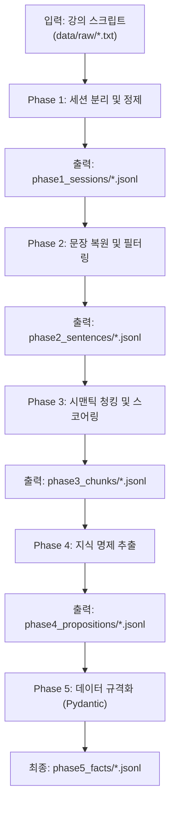

# 🔄 Pre-processor (전처리) 데이터 플로우 가이드

이 문서는 `prototype00` 프로젝트 중 **전처리(Phase 1 ~ Phase 5)** 파이프라인의 데이터 흐름과 각 단계별 입출력 형태 및 주요 역할을 정의합니다.

전처리 파이프라인의 최종 목적은 정제되지 않은 강의 스크립트(`raw`)를 단계적으로 가공하여, 모델 학습 및 문제 생성에 즉시 활용 가능한 **'구조화된 지식 명제 데이터(Facts)'**로 변환하는 것입니다.

---

## 🌊 전체 데이터 플로우 요약



---

## 📂 각 Phase별 상세 스펙

### 📍 Phase 1: 데이터 분리 및 물리적 세척 (`01_cleaner.py`)

- **주요 목적:** 시간 흐름에 따른 맥락 보존을 위해 물리적으로 단락 및 세션을 분리하고, 문맥 기반의 클렌징을 적용합니다.
- **입력:** `data/raw/*.txt` (원본 STT 스크립트)
- **출력:** `data/phase1_sessions/*.jsonl`
- **핵심 작업:**
  - **인접 라인 병합:** 시간 간격 15초 이내의 발화는 같은 단락(Paragraph)으로 병합하여 문맥 단위를 확보합니다.
  - **세션 자동 분할:** 발화 간격이 30분 이상 벌어질 경우 새로운 논리적 세션으로 자동 분할합니다.
  - **정제 및 교정 (Gemini API):** 사전(Dictionary) 치환 방식의 한계를 극복하기 위해, 병합된 단락 단위로 Gemini API를 호출하여 문맥을 해치지 않고 오탈자 교정 및 추임새를 제거합니다. (정규식은 화자 ID와 불필요한 다중 공백 압축에만 사용)
- **데이터 형태:**
  ```json
  {"chunk_id": "2026-02-02_kdt-backendj-21th_오전", "source_file": "2026-02-02_kdt-...txt", "session": 1, "time": "09:03:12", "paragraph": "...정제된 단락 텍스트..."}
  ```
### 📍 Phase 2: 형태소 기반 문장 복원 및 필터링

- **주요 목적:** 발화 단위의 텍스트를 인공지능이 이해하기 좋은 완벽한 '문장 단위'로 쪼개고, 영양가 없는 문장을 버립니다.
- **입력:** `data/phase1_sessions/*.jsonl`
- **출력:** `data/phase2_sentences/*.jsonl`
- **핵심 작업:**
  - **문장 분리:** `kiwipiepy` 형태소 분석기를 사용하여 마침표가 없는 구어체 텍스트를 문장 단위로 분할합니다.
  - **품사(POS) 기반 필터링:** 명사나 동사가 거의 포함되지 않은 단순 감탄사 문장("네", "아 맞습니다" 등)을 제외하여 데이터 밀도를 높입니다.
- **데이터 형태:**
  ```json
  {"session_id": "...", "sent_id": 12, "text": "데이터베이스에서 트랜잭션이란 ...", "pos_tags": [...], "meta": {...}}
  ```

### 📍 Phase 3: 시맨틱 청킹(Chunking) 및 중요도 스코어링

- **주요 목적:** 잘게 쪼개진 문장들을 '문맥과 의미'가 이어지는 단위로 다시 묶고, 해당 묶음(Chunk)에서 중요한 키워드를 뽑아냅니다.
- **입력:** `data/phase2_sentences/*.jsonl`
- **출력:** `data/phase3_chunks/*.jsonl`
- **핵심 작업:**
  - **의미 기반 청킹:** 임베딩 모델(`KR-SBERT` 또는 `KoELECTRA`)을 써서 인접 문장 간의 코사인 유사도를 계산합니다. 유사도가 떨어지는 문맥 전환 지점에서 청크를 자릅니다.
  - **핵심어 추출(TF-IDF):** 묶인 청크 안에서 전체 문서 대비 중요도가 높은 단어들을 식별하고(`keywords`), TF-IDF 점수를 메타데이터에 기록합니다.
- **데이터 형태:**
  ```json
  {"chunk_id": "S01-C03", "session_id": "S01", "sent_ids": [10,11,12], "text": "...여러 문장 합친 내용...", "keywords": ["트랜잭션", "격리성"], "tfidf_scores": {"트랜잭션": 3.21, ...}, "meta": {...}}
  ```

### 📍 Phase 4: 지식 명제 추출 및 구조화

- **주요 목적:** 청크 텍스트 속에서 교육적으로 의미 있는 '규칙, 정의, 절차' 등의 핵심 명제(Fact 후보)를 뽑아냅니다.
- **입력:** `data/phase3_chunks/*.jsonl`
- **출력:** `data/phase4_propositions/*.jsonl`
- **핵심 작업:**
  - **패턴 기반 탐지:** "~란 ...이다", "~하는 방법은" 등의 정해진 정규식 패턴으로 1차 명제를 추출해냅니다.
  - **로컬 SLM(예: Llama-3-8B) 추출:** 소형 모델에 프롬프트를 주어 텍스트 내에서 팩트(Fact) 명제를 생성하도록 합니다.
  - **개념 매칭:** 앞선 Phase 3에서 뽑은 핵심 언어와 추출된 명제를 결합하여 `[개념-설명]` 세트의 후보군을 만듭니다.
- **데이터 형태:**
  ```json
  {"prop_id": "P-000123", "chunk_id": "S01-C03", "type": "definition", "text": "트랜잭션이란 ... 이다.", "concept_candidates": ["트랜잭션"], "meta": {"source_sents": [...], "slm_model": "llama-3-8b", ...}}
  ```

### 📍 Phase 5: 최종 포매팅 및 데이터베이스 구축 (`05_formatter.py`)

- **주요 목적:** 추출된 지식 명제(Phase 4)와 청크 원문/키워드(Phase 3) 데이터를 결합하여 실제 플랫폼과 팀원 간 데이터베이스 연동에 바로 쓸 수 있는 특수 JSON 포맷(`ChunkDocument`, `ConceptDocument`)을 추출합니다.
- **입력:** 
  - `data/phase3_chunks/{input_type}/*.jsonl`
  - `data/phase4_propositions/{input_type}/*.jsonl`
- **출력:** 
  - `data/phase5_formatted/{input_type}/*_chunks_formatted.jsonl`
  - `data/phase5_formatted/{input_type}/*_concepts_formatted.jsonl`
- **핵심 작업:**
  - **ChunkDocument 생성:** 원문 청크 데이터에 주차(`week`), 세션(`session`) 등 메타데이터를 파일명에서 자동 파싱하여 붙이고, 해당 청크에서 도출된 사실 명제(`facts`)들을 리스트로 매핑합니다.
  - **ConceptDocument 생성 (핵심어 DB):** 파편화된 명제들을 특정 개념(`concept`) 단위로 모아서 그룹화합니다. 동일 개념에 대한 문장들을 병합(`definition`)하여 형태를 다듬고, 역참조 정보(`source_chunk_ids`)와 연관어(`related_concepts`)를 추가해 검색과 RAG(검색 증강 생성)에 매우 유리한 지식 데이터베이스 규격으로 조립합니다.
- **데이터 형태 1: `*_chunks_formatted.jsonl` (청크 기반 원문/팩트 매핑)**
  ```json
  {
    "chunk_id": "c01",
    "week": 21,
    "session": "오전",
    "text": "테이블을 병합하는 방법은 ...",
    "facts": ["조인은 관계 기반 데이터 결합으로 ..."],
    "tfidf_keywords": ["조인", "셋 연산자", "서브쿼리"]
  }
  ```
- **데이터 형태 2: `*_concepts_formatted.jsonl` (개념 기반 지식 DB)**
  ```json
  {
    "concept_id": "concept_union",
    "concept": "UNION",
    "definition": "두 SELECT 결과를 세로로 병합하면서 ...",
    "related_concepts": ["concept_join", "concept_cast"],
    "source_chunk_ids": ["c02", "c03"]
  }
  ```

---

## 가이드 (전처리 파트)

- 전처리 과정은 **원본 텍스트를 최대한 정보 밀도가 높은 상태로 군더더기 없이 가공하는 것**이 최우선 목표입니다.
- 각 단계의 스크립트(`pipeline/preprocessor/0N_*.py`) 구현 시 위에서 명시한 **입력 JSON 포맷을 받아 정해진 출력 JSON으로 반환**하는 독립적인 모듈 형태로 작업하면 됩니다.
- **Data 디렉터리(`data/`)**는 깃 관리 대상이 아니며, 오직 로컬 스크립트 런타임에 의해 생성되고 소모되는 공간임을 기억하세요.

---

## ⚙️ CLI 실행 옵션 가이드 (`--input_type` 등)

전처리 스크립트는 여러 옵션 플래그를 통해 다양한 로직과 저장/참조 경로를 유연하게 분리합니다.

### 1. 전역 데이터 참조 경로: `--input_type`
Phase 1(`01_cleaner.py`)에서 제미나이를 사용하여 정제한 결과물과, 정규식으로만 가장 빠르게 파싱한 결과물은 서로 다른 폴더(`gemini_cleaned` 와 `base_cleaned`)에 완전히 분리되어 저장됩니다. 
이후 Phase 2, 3, 4 스크립트는 **어느 폴더의 데이터를 물려받아 후속 처리를 할지**를 `--input_type` 옵션으로 결정합니다.

```bash
# 기본 모드 (옵션 생략 시): base_cleaned 폴더의 데이터를 읽어와 수행합니다.
python pipeline/preprocessor/02_segmenter.py

# 제미나이 정제 모드: gemini_cleaned 폴더의 데이터를 명시적으로 타겟팅합니다.
python pipeline/preprocessor/02_segmenter.py --input_type gemini_cleaned
```

### 2. Phase 4 명제 추출 모델: `--use_ollama` / `--no_gemini`
Phase 4에서 팩트를 추출할 때, 어떤 LLM 엔진을 활성화할지 추가로 결정할 수 있습니다. 
앞서 데이터를 읽어오는 `--input_type` (저장소 분리 기능)과는 완전히 독립적으로 동작합니다.

```bash
# 디폴트: Google Gemini 2.5 API 기반
python pipeline/preprocessor/04_extractor.py

# 로컬 SLM: 로컬의 Ollama (Llama-3 등) 엔진 사용
python pipeline/preprocessor/04_extractor.py --use_ollama

# LLM 끄기: API 없이 오직 정규식 스크립트 패턴만 기반하여 추출
python pipeline/preprocessor/04_extractor.py --no_gemini
```
