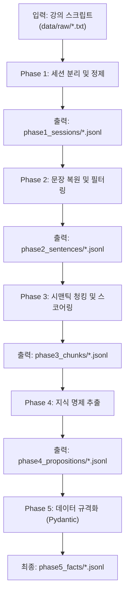

# 🔄 Pre-processor (전처리) 데이터 플로우 가이드

이 문서는 `prototype00` 프로젝트 중 **전처리(Phase 1 ~ Phase 5)** 파이프라인의 데이터 흐름과 각 단계별 입출력 형태 및 주요 역할을 정의합니다.

전처리 파이프라인의 최종 목적은 정제되지 않은 강의 스크립트(`raw`)를 단계적으로 가공하여, 모델 학습 및 문제 생성에 즉시 활용 가능한 **'구조화된 지식 명제 데이터(Facts)'**로 변환하는 것입니다.

---

## 🌊 전체 데이터 플로우 요약



---

## 📂 각 Phase별 상세 스펙

### 📍 Phase 1: 데이터 분리 및 물리적 세척

- **주요 목적:** 통짜 텍스트를 논리적인 세션 단위로 쪼개고, 오타나 불필요한 노이즈를 1차적으로 걷어냅니다.
- **입력:** `data/raw/*.txt` (원본 STT 스크립트)
- **출력:** `data/phase1_sessions/*.jsonl`
- **핵심 작업:**
  - **세션 분할:** 타임스탬프와 설정(`session_rules.json`)을 기반으로 오전/오후, 또는 특정 주제별로 발화를 나눕니다.
  - **용어 교정 (Gemini API):** STT 오인식 단어(예: 마이s큐L -> MySQL, 잡바 -> Java)를 정식 개발 용어로 교정합니다.
  - **정규식(Regex) 클렌징:** 화자 이름, 반복되는 무의미한 감탄사, 불필요한 특수문자 등을 제거합니다.
- **데이터 형태:**
  ```json
  {"session_id": "2025-01-lecture-01#S01", "timestamp": "00:13:21", "speaker": "강사", "text": "...정제된 한 발화...", "meta": {...}}
  ```

### 📍 Phase 2: 형태소 기반 문장 복원 및 필터링

- **주요 목적:** 발화 단위의 텍스트를 인공지능이 이해하기 좋은 완벽한 '문장 단위'로 쪼개고, 영양가 없는 문장을 버립니다.
- **입력:** `data/phase1_sessions/*.jsonl`
- **출력:** `data/phase2_sentences/*.jsonl`
- **핵심 작업:**
  - **문장 분리:** `kiwipiepy` 형태소 분석기를 사용하여 마침표가 없는 구어체 텍스트를 문장 단위로 분할합니다.
  - **품사(POS) 기반 필터링:** 명사나 동사가 거의 포함되지 않은 단순 감탄사 문장("네", "아 맞습니다" 등)을 제외하여 데이터 밀도를 높입니다.
- **데이터 형태:**
  ```json
  {"session_id": "...", "sent_id": 12, "text": "데이터베이스에서 트랜잭션이란 ...", "pos_tags": [...], "meta": {...}}
  ```

### 📍 Phase 3: 시맨틱 청킹(Chunking) 및 중요도 스코어링

- **주요 목적:** 잘게 쪼개진 문장들을 '문맥과 의미'가 이어지는 단위로 다시 묶고, 해당 묶음(Chunk)에서 중요한 키워드를 뽑아냅니다.
- **입력:** `data/phase2_sentences/*.jsonl`
- **출력:** `data/phase3_chunks/*.jsonl`
- **핵심 작업:**
  - **의미 기반 청킹:** 임베딩 모델(`KR-SBERT` 또는 `KoELECTRA`)을 써서 인접 문장 간의 코사인 유사도를 계산합니다. 유사도가 떨어지는 문맥 전환 지점에서 청크를 자릅니다.
  - **핵심어 추출(TF-IDF):** 묶인 청크 안에서 전체 문서 대비 중요도가 높은 단어들을 식별하고(`keywords`), TF-IDF 점수를 메타데이터에 기록합니다.
- **데이터 형태:**
  ```json
  {"chunk_id": "S01-C03", "session_id": "S01", "sent_ids": [10,11,12], "text": "...여러 문장 합친 내용...", "keywords": ["트랜잭션", "격리성"], "tfidf_scores": {"트랜잭션": 3.21, ...}, "meta": {...}}
  ```

### 📍 Phase 4: 지식 명제 추출 및 구조화

- **주요 목적:** 청크 텍스트 속에서 교육적으로 의미 있는 '규칙, 정의, 절차' 등의 핵심 명제(Fact 후보)를 뽑아냅니다.
- **입력:** `data/phase3_chunks/*.jsonl`
- **출력:** `data/phase4_propositions/*.jsonl`
- **핵심 작업:**
  - **패턴 기반 탐지:** "~란 ...이다", "~하는 방법은" 등의 정해진 정규식 패턴으로 1차 명제를 추출해냅니다.
  - **로컬 SLM(예: Llama-3-8B) 추출:** 소형 모델에 프롬프트를 주어 텍스트 내에서 팩트(Fact) 명제를 생성하도록 합니다.
  - **개념 매칭:** 앞선 Phase 3에서 뽑은 핵심 언어와 추출된 명제를 결합하여 `[개념-설명]` 세트의 후보군을 만듭니다.
- **데이터 형태:**
  ```json
  {"prop_id": "P-000123", "chunk_id": "S01-C03", "type": "definition", "text": "트랜잭션이란 ... 이다.", "concept_candidates": ["트랜잭션"], "meta": {"source_sents": [...], "slm_model": "llama-3-8b", ...}}
  ```

### 📍 Phase 5: 데이터 규격화 및 검증

- **주요 목적:** 추출된 명제 후보들을 최종적으로 엄격한 모델 검증을 거쳐, 후속 파이프라인에서 에러 없이 쓸 수 있도록 단단한 JSON 포맷으로 확정합니다.
- **입력:** `data/phase4_propositions/*.jsonl`
- **출력:** `data/phase5_facts/*.jsonl` (또는 `*.json`)
- **핵심 작업:**
  - **스키마 강제 (Pydantic + Instructor):** 추출된 데이터를 지정된 Pydantic 모델 구조에 맞춰 엄격하게 강제 및 생성합니다.
  - **데이터 정제 및 병합:** 개념명과 식별자를 일치시키고, 중복되는 Fact들을 하나로 예쁘게 합칩니다.
  - **이력(Trace) 기록:** 원문이 Phase 1부터 어떻게 정제되어 여기까지 왔는지 로그를 남겨 추적 가능성(Traceability)을 확보합니다.
- **데이터 형태:**
  ```json
  {"id": "F-1001", "concept": "트랜잭션", "fact": "트랜잭션이란 ... 이다.", "source": {...}, "trace": {"phase1": {...}, "phase2": {...}, ...}}
  ```

---

## 가이드 (전처리 파트)

- 전처리 과정은 **원본 텍스트를 최대한 정보 밀도가 높은 상태로 군더더기 없이 가공하는 것**이 최우선 목표입니다.
- 각 단계의 스크립트(`pipeline/preprocessor/0N_*.py`) 구현 시 위에서 명시한 **입력 JSON 포맷을 받아 정해진 출력 JSON으로 반환**하는 독립적인 모듈 형태로 작업하면 됩니다.
- **Data 디렉터리(`data/`)**는 깃 관리 대상이 아니며, 오직 로컬 스크립트 런타임에 의해 생성되고 소모되는 공간임을 기억하세요.
