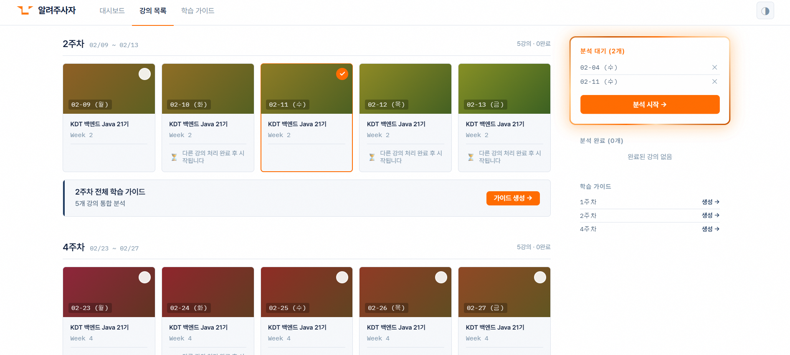
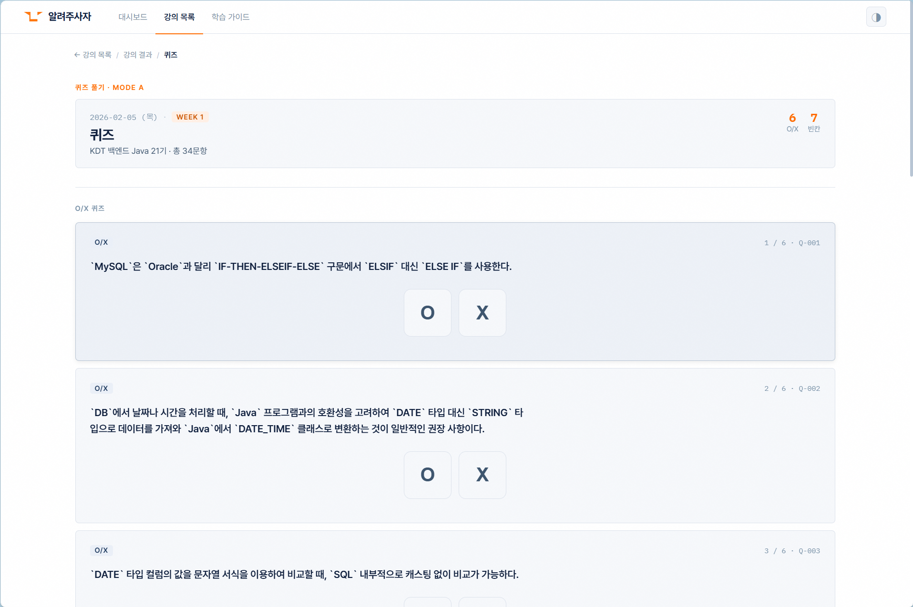

# tell-me-lion 최종 보고서

> **팀명:** 알려주사자
> **프로젝트명:** tell-me-lion (텔미라이언)
> **작성일:** 2026년 4월 2일
> **버전:** v2.0 (최종)

---

## 1. 프로젝트 개요

### 1.1 서비스 소개

**tell-me-lion**은 강의 녹화본(STT 스크립트)을 입력받아 **핵심 개념, 학습 포인트, 퀴즈, 주차별 학습 가이드**를 자동 생성하는 AI 기반 교육 서비스입니다.

> **핵심 UX:** 파일 업로드 없음. 대시보드에서 강의 선택 → 서버가 나머지 처리.

### 1.2 프로젝트 배경 및 목적

| 항목 | 내용 |
|------|------|
| **문제 인식** | 온라인 강의 증가에 따라 수강생이 핵심 내용을 놓치거나, 복습 자료가 부족한 문제 |
| **해결 방향** | AI가 강의 스크립트를 분석하여 핵심 개념 추출, 퀴즈 자동 생성, 학습 가이드 제공 |
| **목적** | 수강생의 학습 효율 극대화 및 교육 업체의 콘텐츠 생산 비용 절감 |
| **대상 사용자** | ① 수강생(최종 사용자) ② 교육 서비스 업체(도입 클라이언트) |

### 1.3 팀 구성 및 역할

| 담당 | 역할 | 주요 작업 |
|------|------|-----------|
| **시훈** | 파이프라인 엔지니어 | 전처리 고도화(Phase 1~5), 배포 최적화, Gemini API 비용 관리 |
| **경현** | AI/퀴즈 엔지니어 | 퀴즈·개념·학습포인트 생성 고도화, Blueprint 설계, 출력 형식 정의 |
| **주노** | 풀스택/배포 | UI/UX 설계·구현, 프론트-백 연동, Vercel+EC2 자동 배포 |

### 1.4 개발 기간 및 규모

| 항목 | 수치 |
|------|------|
| 개발 기간 | 2026.03.10 ~ 2026.04.02 (약 24일) |
| 총 커밋 수 | 202개 |
| PR 수 | 56+ |
| 프론트엔드 | React 페이지 7개, 컴포넌트 9개 (약 2,700줄) |
| 백엔드 API | FastAPI 엔드포인트 12개 |
| 파이프라인 | 전처리 5단계 + 생성 5모듈 |

---

## 2. 중간발표 대비 변경점

### 2.1 완성도 비교

| 영역 | 중간발표 (3/20) | 최종 (4/2) | 변화 |
|------|:---:|:---:|------|
| **Preprocess (Phase 1~5)** | 100% | 100% | Phase별 스킵 로직 추가 |
| **EP (핵심 개념 추출)** | 100% | 100% | 유지 |
| **Blueprint (퀴즈 설계)** | 100% | 100% | 유지 |
| **Quiz Generation** | 30% | **100%** | LLM 기반 문항 생성 완성 |
| **QA Validation** | 10% | **100%** | 검증 파이프라인 완성 |
| **Guides (학습 가이드)** | 10% | **100%** | 주차별 통합 가이드 생성 완성 |
| **백엔드 API** | 60% | **100%** | 파이프라인 연동 완료, 상태 관리 |
| **프론트엔드** | 50% | **100%** | 7개 페이지 + 9개 컴포넌트 완성 |

### 2.2 주요 개선사항

**중간발표 시점에서 해결한 과제들:**

1. **Quiz Generation 블록 완성** — Blueprint 기반 LLM 퀴즈 생성, 5가지 유형 지원
2. **QA Validation 완성** — 생성된 퀴즈의 정확성·사실 일치 검증
3. **주차별 학습 가이드 완성** — 1주치 강의 통합 요약 및 학습 로드맵 생성
4. **프론트-백엔드 완전 연동** — 더미 데이터 → 실제 파이프라인 출력 연결
5. **중단/재개 기능** — partial 상태 관리로 처리 중단 시 이어서 진행
6. **Phase별 스킵** — 이전 단계 완료 시 재시작 없이 다음 단계부터 실행
7. **실시간 진행률 표시** — 명제 추출·퀴즈 생성 단계별 세부 상황 표시
8. **CI/CD 자동 배포** — main push → Vercel(프론트) + EC2(백엔드) 자동 배포

---

## 3. 핵심 기능 및 산출물

### 3.1 두 가지 사용 모드

| 모드 | 입력 | 산출물 | 사용 시나리오 |
|------|------|--------|---------------|
| **Mode A** (단일 강의) | 강의 스크립트 1개 | 핵심 개념, 학습 포인트, 퀴즈 | 특정 강의 복습 |
| **Mode B** (주차 단위) | 1주치 강의 전체 | 주차별 학습 가이드·핵심 요약 | 주간 복습·시험 대비 |

### 3.2 Mode A — 단일 강의 산출물

#### 핵심 개념 (Concept)

강의에서 추출된 주요 개념 목록. 각 개념은 **정의, 중요도 점수(0~1), 관련 개념, 출처 청크**를 포함합니다.

```json
{
    "concept_id": "concept_추상",
    "concept": "추상",
    "definition": "추상 클래스는 주요 메소드인 추상 메서드를 가지고 있다.",
    "related_concepts": ["concept_바이트", "concept_캐릭터", "concept_아웃풋"],
    "source_chunk_ids": ["2026-02-02_S01_C144", "2026-02-02_S01_C204"],
    "importance": 0.302
}
```

#### 학습 포인트 (Learning Point)

수강생이 반드시 이해해야 할 학습 목표. 개념과 동일한 구조로 학습 방향 제시에 활용됩니다.

#### 퀴즈 (Quiz)

강의 내용 기반 자동 생성 문항. **5가지 유형**을 지원하며 모든 문항에 해설이 포함됩니다.

### 3.3 퀴즈 유형

| 유형 | 코드 | 설명 |
|------|------|------|
| **개념 정의형 객관식** | `mcq_definition` | 핵심 개념의 정의를 4지선다로 확인 |
| **오개념 객관식** | `mcq_misconception` | 흔한 오해를 선지에 포함하여 정확한 이해 검증 |
| **빈칸 채우기** | `fill_blank` | 핵심 용어를 직접 채워 넣는 방식 |
| **OX 퀴즈** | `ox_quiz` | 참/거짓 판별로 빠른 개념 확인 |
| **코드 실행형** | `code_execution` | SQL/코드 실행 결과를 예측하는 문제 |

```json
{
    "quiz_id": "quiz_추상_mcq_1",
    "blueprint_id": "bp_추상",
    "question_type": "mcq_definition",
    "difficulty": "중",
    "question": "추상 클래스에 대한 설명으로 올바른 것은?",
    "choices": [
        { "id": 1, "text": "추상 클래스는 인스턴스를 직접 생성할 수 있다.", "is_answer": false },
        { "id": 2, "text": "추상 클래스는 추상 메서드를 포함할 수 있다.", "is_answer": true },
        { "id": 3, "text": "추상 클래스는 상속이 불가능하다.", "is_answer": false },
        { "id": 4, "text": "추상 클래스는 final 키워드와 함께 사용된다.", "is_answer": false }
    ],
    "explanation": "추상 클래스는 하위 클래스가 반드시 구현해야 하는 추상 메서드를 포함할 수 있습니다."
}
```

### 3.4 Mode B — 주차별 학습 가이드

1주치 강의 전체를 통합 분석하여 **학습 로드맵**과 **핵심 요약**을 생성합니다.

```json
{
    "week": 5,
    "summary": "이번 주차에서는 Java I/O 스트림의 계층 구조와 ...",
    "key_concepts": ["추상 클래스", "바이트 스트림", "캐릭터 스트림", "직렬화"],
    "meta": { "lecture_count": 4, "total_concepts": 15 }
}
```

### 3.5 퀴즈 품질 보장 전략

| 단계 | 전략 | 설명 |
|------|------|------|
| **1. Blueprint 설계** | 사전 설계 | 개념별 중요도에 따라 퀴즈 유형·난이도·수량을 사전 계획 |
| **2. Evidence 기반 생성** | RAG | 팩트 DB에서 정답 근거(correct_facts)와 오답 근거(distractor_facts)를 분리 확보 |
| **3. LLM 문항 생성** | Blueprint → Quiz | Blueprint의 설계 명세에 따라 LLM이 실제 문항 생성 |
| **4. QA 검증** | 자동 검증 | 생성된 퀴즈의 정확성·사실 일치 여부 자동 검증 |

### 3.6 난이도 조절 및 문항 설계

난이도는 Blueprint의 `importance`(개념 중요도)와 `chunk_distance_minutes`(강의 내 반복 출현 거리)를 LLM에 전달하고, 프롬프트 내 규칙으로 상/중/하 분배를 제어합니다.

**난이도별 문항 설계 기준:**

| 난이도 | 질문 길이 | 선지 구성 | 출제 대상 |
|:------:|----------|----------|----------|
| **하** | 15~24자 (짧은 질문) | 개념어, 영문 키워드, 메서드명 위주 (4지선다 허용) | 기초 문법, 키워드 식별 |
| **중** | 21~30자 | 명사구, 짧은 서술형 문장 (5지선다) | 개념 정의, 특징 판단 |
| **상** | 30자 이상 (상세한 질문) | 예외·세부 동작을 다루는 복합 서술형 (5지선다) | 복수 조건, 예외 판별 |

**유형별 쿼터:**
- O/X 퀴즈: 전체의 최대 20%
- 빈칸 채우기: 최소 20% 이상
- 객관식: distractor 2개 이상일 때만 출제
- 강의 1개당 30문항 배치 생성

**오답 선지 설계 4대 패턴:**

| 패턴 | 설명 |
|------|------|
| 인접 개념 함정 | 같은 범주의 유사 개념 특징을 가져와 혼동 유발 |
| 속성 반전 함정 | 핵심 속성(예: 읽기 전용)을 반대(쓰기 가능)로 교체 |
| 키워드 중첩 함정 | 올바른 키워드로 시작하되 후반부 성질을 다르게 조작 |
| 과장형 함정 | 대부분 맞는 문장에 "반드시", "~에서만" 등 절대 표현 삽입 |

### 3.7 퀴즈 검증 (Validator)

LLM이 생성한 퀴즈는 자동 검증을 거쳐 통과한 문항만 저장됩니다.

| 검증 항목 | 조건 |
|-----------|------|
| `source_text` | 비어있지 않을 것 (출처 근거 필수) |
| `question` | 비어있지 않을 것 |
| `explanation` | 비어있지 않을 것 (해설 필수) |
| MCQ `choices` | 존재 + `is_answer=True`가 정확히 1개 |
| MCQ 선지 수 | 최소 2개 이상 |
| fill_blank / ox_quiz | `answers` 비어있지 않을 것 |
| `used_fact_ids` | 최소 1개 (강의 원문 근거 필수) |

검증 실패 문항은 제외되며, 통과율과 실패 사유가 로깅됩니다.

---

## 4. 시스템 아키텍처

### 4.1 전체 구조 (3계층)

```
┌──────────────────────────────────────────────────────────────────────┐
│                     Frontend — React 19 + TypeScript + Vite          │
│        대시보드 UI, 퀴즈 풀이, 결과 조회, 실시간 진행률 표시          │
│                          Vercel 자동 배포                            │
├──────────────────────────────────────────────────────────────────────┤
│                     Backend — FastAPI (Python)                       │
│        REST API 12개 엔드포인트, 비동기 파이프라인 실행               │
│                  AWS EC2 Docker + GitHub Actions                     │
├──────────────────────────────────────────────────────────────────────┤
│                     Pipeline — Python 데이터 처리                    │
│    전처리(Phase 1~5) → EP → Blueprint → Quiz Gen → QA → Guides      │
│              Gemini API + KR-SBERT + kiwipiepy + TF-IDF              │
└──────────────────────────────────────────────────────────────────────┘
```

### 4.2 파이프라인 상세 흐름

#### 전처리 단계 (Phase 1~5)

원시 강의 스크립트를 정제하여 **구조화된 지식 명제 데이터(Facts)**로 변환하는 핵심 과정입니다.

| 단계 | 모듈 | 주요 작업 |
|------|------|-----------|
| **Phase 1** | `01_cleaner.py` | 시간 간격 기준 발화 병합, 세션 분할, Gemini API로 오탈자·추임새 교정 |
| **Phase 2** | `02_segmenter.py` | `kiwipiepy` 형태소 분석으로 구어체→문장 단위 분할, 무의미 문장 필터링 |
| **Phase 3** | `03_chunker.py` | `KR-SBERT` 임베딩 유사도 기반 시맨틱 청킹, TF-IDF 핵심어 추출 |
| **Phase 4** | `04_extractor.py` | 정규식 + LLM(Gemini/Ollama)으로 교육적 핵심 명제(Fact) 추출 |
| **Phase 5** | `05_formatter.py` | 개념 단위 그룹화, 역참조·연관어 추가, RAG 최적화 JSON 포맷 조립 |

#### Mode A 전체 흐름

```
스크립트 1개 (.txt)
    ↓
[Phase 1~5] 전처리 — STT 정제 → 문장 → 청크 → 명제 → 팩트
    ↓                   (이미 완료된 단계는 자동 스킵)
[EP] 핵심 개념·학습 포인트 추출
    ↓
[Blueprint] 퀴즈 설계 — 유형·난이도·근거 자료
    ↓
[Quiz Generation] LLM 기반 문항 생성
    ↓
[QA Validation] 품질 검증
    ↓
[출력] 핵심 개념 + 학습 포인트 + 퀴즈 (해설 포함)
```

#### Mode B 전체 흐름

```
1주치 강의 스크립트 N개
    ↓
[Phase 1~5] 각 파일 전처리 (완료된 강의는 스킵)
    ↓
[Guides] 주차 통합 — N개 결과 종합 → 학습 가이드·핵심 요약
    ↓
[출력] 주차별 학습 가이드 + 핵심 요약
```

### 4.3 API 설계

| 메서드 | 엔드포인트 | 설명 |
|--------|-----------|------|
| `GET` | `/api/lectures` | 전체 강의 목록 |
| `GET` | `/api/lectures/{id}` | 단일 강의 상세 |
| `POST` | `/api/lectures/{id}/process` | 강의 처리 시작 (Mode A) |
| `GET` | `/api/lectures/{id}/status` | 처리 진행 상태 폴링 |
| `GET` | `/api/lectures/{id}/results` | 처리 결과 조회 (개념+퀴즈) |
| `GET` | `/api/weeks` | 주차 목록 |
| `GET` | `/api/weeks/{week}` | 주차 상세 |
| `POST` | `/api/weeks/{week}/process` | 주차 처리 시작 (Mode B) |
| `GET` | `/api/weeks/{week}/status` | 주차 처리 상태 |
| `GET` | `/api/weeks/{week}/results` | 주차 학습 가이드 조회 |

### 4.4 배포 아키텍처

```
GitHub (main branch)
    │
    ├─→ Vercel ─→ wonder-girls.vercel.app (프론트엔드)
    │     자동 빌드·배포 (push 감지)
    │
    └─→ GitHub Actions ─→ AWS EC2 (백엔드)
          deploy-backend.yml
          SSH → git pull → docker compose up → health check
```

| 레이어 | 플랫폼 | 주소 | 배포 방식 |
|--------|--------|------|-----------|
| 프론트엔드 | Vercel | `wonder-girls.vercel.app` | main push → 자동 빌드·배포 |
| 백엔드 | AWS EC2 | `15.165.140.229` | GitHub Actions → SSH → Docker |

**PR 머지 = 배포 완료.** 수동 배포 불필요.

---

## 5. UI/UX 설계

### 5.1 설계 원칙

> **"멋쟁이사자처럼 오렌지가 네이비 위에 정확하게 찍힌다 — 공부 앱이 아니라 대시보드 같다"**

- **파일 업로드 없음** — 대시보드에서 강의 선택만으로 모든 처리 시작
- **실시간 피드백** — 8단계 처리 과정을 단계별 진행률로 표시
- **라이트/다크 테마** — `prefers-color-scheme` 자동 대응

### 5.2 디자인 시스템

| 요소 | 값 | 용도 |
|------|-----|------|
| 주색 | `#FF6B00` (멋사 오렌지) | 프라이머리, 강조, CTA |
| 부색 | `#0F1F3D` (딥 네이비) | 텍스트, 세컨더리 |
| 배경 | `#FFFFFF` / `#F6F8FB` | 기본 / 카드 배경 |
| 폰트 | Pretendard (본문) + IBM Plex Mono (코드) | 한글 최적화 |
| 퀴즈 색상 | 오렌지(객관식), 블루(`#4D7FA8` 빈칸채우기), 그린(`#2D6A4F` 코드) | 유형별 시각 구분 |

### 5.3 페이지 구성

| 경로 | 페이지 | 기능 |
|------|--------|------|
| `/` | **Dashboard** | 강의 선택, 처리 시작, 전체 현황 |
| `/lectures` | **LecturesPage** | 강의 목록, 상태별 필터링, 분석 시작 |
| `/lecture/:id` | **LectureResult** | 핵심 개념·학습 포인트·퀴즈 결과 조회 |
| `/weekly/:week` | **WeeklyResult** | 주차별 학습 가이드·핵심 요약 |
| `/guides` | **GuidesPage** | 학습 가이드 모아보기 |
| `/quiz` | **QuizPage** | 퀴즈 풀이 인터페이스 |

### 5.4 주요 화면

> **[스크린샷 삽입 위치]**
>
> 아래 6개 화면의 스크린샷을 `docs/images/` 디렉터리에 저장 후 삽입하세요.

**① 대시보드 (`/`)**

`docs/images/dashboard.png` — 강의 목록과 주차별 현황이 한눈에 보이는 메인 화면

**② 강의 목록 (`/lectures`)**

`docs/images/lectures.png` — 강의별 처리 상태(idle/processing/completed) 필터링

**③ 처리 진행률 표시**

`docs/images/processing.png` — 8단계 처리 과정의 실시간 진행 상태 (Phase 1~5 + EP + Blueprint + Quiz)

**④ 강의 분석 결과 (`/lecture/:id`)**

`docs/images/lecture-result.png` — 핵심 개념 카드 + 학습 포인트 + 퀴즈 목록

**⑤ 퀴즈 풀이 화면**

`docs/images/quiz.png` — 객관식/빈칸채우기/OX 등 유형별 퀴즈 카드와 해설

**⑥ 주차별 학습 가이드 (`/weekly/:week`)**

`docs/images/weekly-guide.png` — 주차 핵심 요약 + 핵심 개념 목록

### 5.5 주요 컴포넌트

| 컴포넌트 | 역할 |
|----------|------|
| `ConceptCard` | 핵심 개념 표시 (오렌지 세로 바 + 중요도 점수) |
| `QuizCard` | 퀴즈 유형별 색상 구분 + 풀이 인터페이스 |
| `ProcessingStatus` | 8단계 처리 진행률 실시간 표시 |
| `ProgressRing` | 원형 진행률 표시 |
| `CodeEditor` | 코드 실행형 퀴즈용 에디터 (Monaco Editor) |
| `OutputPanel` | 산출물 출력 패널 |

---

## 6. 교육 현장 적용 시나리오

### 6.1 교육 서비스 업체 (도입 클라이언트) 관점

**기존 워크플로우:**
1. 강사가 강의 녹화
2. 운영팀이 수동으로 강의 요약 작성 (1~2시간/강의)
3. 문항 출제 전문가가 퀴즈 제작 (2~3시간/강의)
4. 학습 가이드 제작 (1시간/주차)

**tell-me-lion 도입 후:**
1. 강사가 강의 녹화 (동일)
2. 대시보드에서 강의 선택 → **자동으로 핵심 개념·퀴즈·학습 가이드 생성**
3. 운영팀은 생성 결과만 검수

**효과:** 강의당 콘텐츠 제작 시간 4~6시간 → 검수 30분으로 단축

### 6.2 수강생 관점

| 학습 단계 | tell-me-lion 활용 |
|-----------|-------------------|
| **수업 전** | 주차별 학습 가이드로 이번 주 학습 로드맵 파악 |
| **수업 중** | 핵심 개념 목록으로 강의 포인트 집중 |
| **수업 후** | 자동 생성 퀴즈로 이해도 자가 점검 |
| **시험 대비** | 주차별 핵심 요약으로 빠른 복습 |

### 6.3 확장 가능성

- **다중 과목 지원** — 현재 IT/프로그래밍 강의 기준이나, 프롬프트 조정만으로 다른 도메인(경영, 법학 등) 확장 가능
- **대량 처리** — 대시보드에서 여러 강의를 순차 선택하면 백그라운드에서 자동 처리
- **API 연동** — REST API 기반이므로 기존 LMS에 퀴즈·가이드 데이터 연동 가능

---

## 7. 문제 해결 과정

### 6.1 퀴즈 품질 보장

**문제:** LLM으로 퀴즈를 직접 생성하면 사실과 다른 문항, 모호한 선지, 난이도 편중 발생

**해결:** Blueprint → Evidence → Generation → Validation 4단계 파이프라인

1. **Blueprint (Evidence 분리)** — 각 개념에 대해 `correct_facts`(정답 근거)와 `distractor_facts`(오답 재료)를 자동 분리. 오답 재료는 같은 청크의 나머지 facts + 관련 개념의 facts에서 수집하여 맥락적 그럴듯함을 보장
2. **LLM 배치 생성** — 전체 Blueprint + 강의 원문 청크를 Gemini 2.5 Flash에 단일 호출로 전달. 30문항을 한 번에 생성하여 문항 간 중복을 방지하고 API 비용 최소화
3. **STT 노이즈 필터링** — 프롬프트에서 "3번 패키지", "저기", "이 밑에 있는 것" 등 화면 지칭 대명사를 IT 표준 용어로 치환하도록 강제. 정체불명 단어가 정답/선지에 포함되면 해당 문항 출제 자체를 건너뜀
4. **자동 검증** — `source_text`, `question`, `explanation` 존재 확인, MCQ 정답 개수(정확히 1개) 검증, `used_fact_ids`(강의 원문 근거) 필수 등 7개 항목 검증 후 통과 문항만 저장

### 6.2 전처리 효율화

**문제:** 강의 1개 전처리에 수 분 소요, 중간에 실패하면 처음부터 재시작

**해결:**
- **Phase별 스킵 로직** — 각 단계 출력 파일 존재 여부를 확인하여 이미 완료된 단계는 자동 스킵
- **중단/재개 기능** — `partial` 상태 도입으로 중간 단계까지 완료된 강의를 재개 가능
- **세부 진행률 표시** — Phase 4 명제 추출 시 `15/42 단락 | 명제 38개` 형태로 실시간 피드백

### 6.3 Gemini API 비용 관리

**문제:** Phase 1(텍스트 정제), Phase 4(명제 추출), Quiz Generation에서 LLM 호출 빈번

**해결:**
- Phase 3 시맨틱 청킹으로 LLM 입력 크기 사전 축소
- Blueprint에서 불필요한 퀴즈 생성 방지 (개념 중요도 기반 필터링)
- Phase별 결과 캐싱으로 중복 API 호출 제거

### 6.4 실시간 처리 상태 관리

**문제:** 8단계 파이프라인(Phase 1~5 + EP + Blueprint + Quiz) 실행 중 사용자에게 피드백 없음

**해결:**
- 인메모리 `JobState` 관리로 각 단계 상태(pending/running/done) 실시간 추적
- 프론트엔드에서 5초 간격 폴링으로 진행률 UI 업데이트
- 서버 재시작 시에도 결과 파일 기반으로 상태 자동 복구

### 6.5 주차 가이드 생성 시 미완료 강의 처리

**문제:** 1주치 강의 중 일부만 처리 완료된 상태에서 학습 가이드 생성 시 불완전한 결과

**해결:**
- 미완료 강의 존재 시 학습 가이드 생성 버튼 비활성화
- 분석 시작 전 확인 다이얼로그로 미완료 강의 목록 표시
- `guide_status`를 `status`와 분리하여 독립적 상태 관리

---

## 7. 프로젝트 관리

### 7.1 협업 프로세스

- **GitHub PR 기반** — 모든 변경은 feature 브랜치 → PR → 코드 리뷰 → main 머지
- **태스크 관리** — `docs/tasks/TASK-{번호}-{설명}.md` 파일로 작업 항목 추적
- **자동 배포** — PR 머지 시 프론트엔드(Vercel)·백엔드(EC2) 동시 자동 배포

### 7.2 기술 스택

| 영역 | 기술 |
|------|------|
| **프론트엔드** | React 19, TypeScript, Vite, Tailwind CSS, react-router-dom v7 |
| **백엔드** | FastAPI, Pydantic, asyncio, uvicorn |
| **파이프라인** | Gemini API, KR-SBERT, kiwipiepy, TF-IDF |
| **인프라** | Vercel (프론트), AWS EC2 + Docker (백엔드), GitHub Actions (CI/CD) |
| **형상 관리** | Git, GitHub (PR 기반 협업) |

### 7.3 주요 마일스톤

| 시기 | 마일스톤 |
|------|----------|
| 3/10~3/15 | 프로젝트 초기 설정, 전처리 파이프라인(Phase 1~5) 완성 |
| 3/16~3/20 | EP·Blueprint 완성, **중간발표** |
| 3/21~3/26 | Quiz Generation·QA Validation 구현, 프론트-백 연동 |
| 3/27~4/01 | 학습 가이드 완성, 중단/재개·Phase 스킵·진행률 표시 |
| 4/02 | 최종 안정화, **최종 보고서** |

---

## 8. 향후 발전 방향

### 8.1 보너스 기능 확장

| 기능 | 설명 | 구현 난이도 |
|------|------|:-----------:|
| **수강생 오답 패턴 분석** | 퀴즈 풀이 이력 기반 개인 맞춤형 추가 학습 추천 | 중 |
| **적응형 난이도 조절** | 수강생 정답률에 따라 난이도 동적 조정 | 상 |
| **LMS 연동** | SCORM/xAPI 표준으로 LMS 자동 퀴즈 배포 | 상 |

### 8.2 기술 개선 방향

| 영역 | 개선 방향 |
|------|-----------|
| **개념 추출 정밀도** | 한국어 주어 조사 패턴 확장, Tier 분류 (CORE/MID/AUX) |
| **RAG 검색** | 벡터 DB(Chroma/Pinecone) 도입으로 임베딩 기반 검색 고도화 |
| **퀴즈 다양성** | 매칭형, 순서 배열형, 다중 선택형 등 추가 유형 |
| **비용 최적화** | 모델 경량화(Ollama 로컬 추론), 캐싱 고도화 |

---

## 9. 제출물 체크리스트

| # | 제출물 | 상태 | 비고 |
|---|--------|:----:|------|
| 1 | 퀴즈 세트 샘플 (3개 강의 이상, 강의당 10문항+) | ✅ | 5가지 유형 (MCQ 정의형/오개념, 빈칸채우기, OX, 코드실행) |
| 2 | 학습 가이드 샘플 (주차별 요약, 개념 맵) | ✅ | Mode B 학습 가이드 생성 완료 |
| 3 | 서비스 시연 영상 (5분 이내) | 📹 | 별도 제작 |
| 4 | 최종 보고서 및 GitHub Repository | ✅ | 본 문서 + github.com/tell-me-lion |

---

## 부록

### A. 프로젝트 구조

```
tell-me-lion/
├── frontend/                # React + TypeScript + Vite
│   └── src/
│       ├── pages/           # Dashboard, LecturesPage, LectureResult,
│       │                    # WeeklyResult, GuidesPage, QuizPage, NotFound
│       ├── components/      # ConceptCard, QuizCard, ProcessingStatus,
│       │                    # ProgressRing, CodeEditor, OutputPanel 등
│       ├── services/        # API 호출 (api.ts)
│       ├── types/           # TypeScript 타입 (models.ts)
│       └── hooks/           # 커스텀 훅
├── app/                     # FastAPI 백엔드
│   ├── api/routes.py        # REST API 엔드포인트 (12개)
│   ├── schemas/models.py    # Pydantic 모델 (17개)
│   ├── loaders/             # 카탈로그·결과 데이터 로더
│   └── state.py             # 인메모리 Job 상태 관리
├── pipeline/                # 전처리 + 생성 파이프라인
│   ├── preprocessor/        # Phase 1~5 (cleaner, segmenter, chunker,
│   │                        #             extractor, formatter)
│   ├── ep/                  # 핵심 개념·학습 포인트 추출
│   ├── blueprint/           # 퀴즈 설계 (유형·난이도·근거)
│   ├── quiz_generation/     # LLM 기반 퀴즈 생성
│   ├── qa_validation/       # 퀴즈 품질 검증
│   └── guides/              # 주차별 학습 가이드 생성
├── config/                  # 파이프라인 설정 파일
├── docs/                    # 태스크 명세, 보고서
├── .github/workflows/       # CI/CD (deploy-backend.yml)
├── DESIGN.md                # UI 디자인 가이드
├── PROJECT_GOALS.md         # 평가 기준·제출물
└── CLAUDE.md                # 개발 규칙
```

### B. 데이터 흐름 요약

```
data/raw/*.txt              → 원시 강의 스크립트
data/phase1_sessions/       → 세션 분리 결과
data/phase2_sentences/      → 문장 분리 결과
data/phase3_chunks/         → 시맨틱 청크
data/phase4_propositions/   → 명제 추출 결과
data/phase5_facts/          → 정제된 팩트 데이터
data/ep_concepts/           → 핵심 개념
data/ep_learning_points/    → 학습 포인트
data/blueprints/            → 퀴즈 설계 명세
data/quizzes_raw/           → 생성된 퀴즈
data/quizzes_validated/     → 검증 완료 퀴즈
data/learning_guides/       → 주차별 학습 가이드
```
